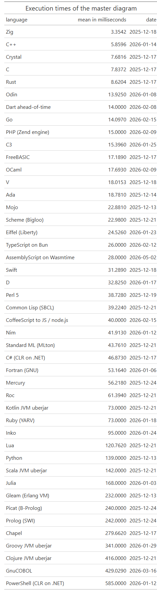

2025-12-10: see [On configuring building and execution environments](https://github.com/practicalcomputerscience/MicrobenchmarkGPHLlanguages/tree/main#on-configuring-building-and-execution-environments): the new SSD drive is faster than the old one; in December 2025, I repeated all execution time measurements for all languages I implemented so far, often - but not always - with up-to-date language versions.

<br/>

# Program execution times

Table of contents:

- [Master diagram with most program environments](#master-diagram-with-most-program-environments)
- [Java native languages Scala, Kotlin and Clojure and their speedup with the GraalVM](#java-native-languages-scala-kotlin-and-clojure-and-their-speedup-with-the-graalvm)
- [Tested Scheme dialects](#tested-scheme-dialects)
- [Programming languages for virtual machines](#programming-languages-for-virtual-machines)
- ["Web programming"](#web-programming)
- [The Clojure example](the-clojure-example)

<br/>

My version of _perf-stat_ (https://linux.die.net/man/1/perf-stat) in use is:

```
$ perf --version
perf version 6.14.11
$
```

<br/>

### Master diagram with most program environments

<br/>




So far:

- [OCaml](https://github.com/practicalcomputerscience/MicrobenchmarkGPHLlanguages/tree/main/03%20-%20source%20code/02%20-%20functional%20languages/OCaml#ocaml) is the fastest [functional programming language](https://github.com/practicalcomputerscience/MicrobenchmarkGPHLlanguages/tree/main/03%20-%20source%20code/02%20-%20functional%20languages#functional-languages),
- [Perl 5](https://github.com/practicalcomputerscience/MicrobenchmarkGPHLlanguages/tree/main/03%20-%20source%20code/01%20-%20imperative%20languages/Perl%205#perl-5) the fastest interpreted language, and
- [C#](https://github.com/practicalcomputerscience/MicrobenchmarkGPHLlanguages/tree/main/03%20-%20source%20code/01%20-%20imperative%20languages/C%23#c) the fastest language on a virtual machine.

<br/>

---

### Java native languages Scala, Kotlin and Clojure and their speedup with the GraalVM

GraalVM for the compilation of an ahead-of-time (AOT) native image, that is an standalone, binary executable for Linux :


https://www.graalvm.org/

See more details at page [Graal Virtual Machine (GraalVM)](https://github.com/practicalcomputerscience/MicrobenchmarkGPHLlanguages/tree/main/04%20-%20GraalVM#graal-virtual-machine-graalvm)

<br/>

---

### Tested Scheme dialects


See more details at page [Scheme](https://github.com/practicalcomputerscience/MicrobenchmarkGPHLlanguages/tree/main/03%20-%20source%20code/02%20-%20functional%20languages/Scheme#scheme)

<br/>

---

### Programming languages for virtual machines


<br/>

---

### "Web programming"


Well, WebAssembly is also a virtual machine: [The WebAssembly (Wasm) virtual machine](https://github.com/practicalcomputerscience/MicrobenchmarkGPHLlanguages/tree/main/03%20-%20source%20code/05%20-%20%22web%20languages%22%20on%20node.js%2C%20WebAssembly%20and%20Wasmtime#the-webassembly-wasm-virtual-machine)

<br/>

---

### The Clojure example

The execution time of uberJAR file _random_streams_for_perf_stats-0.1.0-SNAPSHOT-standalone.jar_, being executed on the Java Virtual Machine, can be measured with this script command: 

```
$ ./exe_times_statistics_for_one_test_case_in_cwd2a java -jar ./target/uberjar/random_streams_for_perf_stats-0.1.0-SNAPSHOT-standalone.jar
...
mean = 424 [milliseconds]
$
```

..or with the [multitime](https://tratt.net/laurie/src/multitime/) command:

```
$ multitime -n 20 java -jar ./target/uberjar/random_streams_for_perf_stats-0.1.0-SNAPSHOT-standalone.jar
...
===> multitime results
1: java -jar ./target/uberjar/random_streams_for_perf_stats-0.1.0-SNAPSHOT-standalone.jar
            Mean        Std.Dev.    Min         Median      Max
real        0.422       0.006       0.414       0.421       0.434       
user        1.222       0.019       1.189       1.224       1.249       
sys         0.083       0.007       0.073       0.083       0.100       
$
```

<br/>

With the _perf-stat_ program, mean and other summary statistics may look like this:

```
$ sudo perf stat -r 20 java -jar ./target/uberjar/random_streams_for_perf_stats-0.1.0-SNAPSHOT-standalone.jar
...
 Performance counter stats for 'java -jar ./target/uberjar/random_streams_for_perf_stats-0.1.0-SNAPSHOT-standalone.jar' (20 runs):

          1,339.08 msec task-clock                       #    3.118 CPUs utilized               ( +-  0.66% )
             6,314      context-switches                 #    4.715 K/sec                       ( +-  0.80% )
               136      cpu-migrations                   #  101.562 /sec                        ( +-  4.60% )
            46,337      page-faults                      #   34.604 K/sec                       ( +-  0.37% )
     8,429,448,451      instructions                     #    1.39  insn per cycle              ( +-  0.50% )
     6,072,948,170      cycles                           #    4.535 GHz                         ( +-  0.65% )
     1,667,136,764      branches                         #    1.245 G/sec                       ( +-  0.53% )
        53,257,086      branch-misses                    #    3.19% of all branches             ( +-  0.44% )
                        TopdownL1                 #     10.0 %  tma_backend_bound      
                                                  #     39.2 %  tma_bad_speculation    
                                                  #     29.3 %  tma_frontend_bound     
                                                  #     21.5 %  tma_retiring             ( +-  0.54% )

           0.42950 +- 0.00210 seconds time elapsed  ( +-  0.49% )

$
```

These three execution time measurements took place on 2025-12-21.

<br/>

##_end
