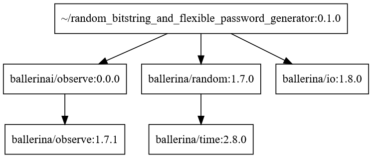

# Ballerina aka jBallerina

https://ballerina.io/ (*)

https://github.com/ballerina-platform/ballerina-lang

https://github.com/ballerina-guides

https://en.wikipedia.org/wiki/Ballerina_(programming_language)

- JDK = Java Development Kit
- JRE = Java Runtime Environment
- JVM = Java Virtual Machine

---

Table of contents:

- [Idea of Ballerina: simpler enterprise integration](#idea-of-ballerina-simpler-enterprise-integration)
- [Installation and compilation tips](#installation-and-compilation-tips)
- [Static code analysis](#static-code-analysis)
- [Generating a dependency graph](#generating-a-dependency-graph)
- [Ahead Of Time (AOT) program compilation with the GraalVM](#ahead-of-time-aot-program-compilation-with-the-graalvm)

<br/>

---

## Idea of Ballerina: simpler enterprise integration

Ballerina, "developed by WSO2 since 2016 and first released in February 2022" (*) makes a good job - at first - to hide the fact that it's another general purpose, high-level programming language to be natively executed on the Java Virtual Machine.

I only noticed it at chapter [Run the package](https://ballerina.io/learn/get-started/#run-the-package) on page [Get started](https://ballerina.io/learn/get-started/), where "generate an executable file" with the _$ bal build_ shell command is explained. It's very easy to check this out:

```
$ bal new hello_world
...
$ cd hello_world
$ bal build
...
$ java -jar ./target/bin/hello_world.jar
WARNING: Incompatible JRE version '25.0.2' found. This ballerina program supports running on JRE version '21.0.*'
Hello, World!
$ 
```
> Although Ballerina is not designed to be a JVM language, the current implementation, which targets the JVM, aka jBallerina, provides Java interoperability by adhering to the Ballerina language semantics.

from: [Call Java code from Ballerina](https://ballerina.io/learn/call-java-code-from-ballerina/)

Though, initially this was not the plan, but implementing a virtual machine of their own:

> Early in its development, the Ballerina team attempted to implement their own virtual machine, but experienced performance bottlenecks. Known as the Ballerina Virtual Machine (BVM), this VM executed Ballerina programs by interpreting BVM bytecode emitted by the Ballerina compiler. However, the Ballerina team ultimately decided that the BVM, despite having been implemented in Java, was not ready for production use, and decided in favor of including a compiler that targets the JVM with the release of version 1.0.

From: [Ballerina - An Open Source JVM Language and Platform for Cloud-Era Application Programmers](https://www.infoq.com/news/2020/01/wso2-releases-ballerina-1-1/) from Jan 29, 2020

However, the bigger idea of Ballerina is this:

> The high-level goal is to create a programming language and a platform co-designed together to make enterprise integration simpler, more agile and DevOps friendly by including cloud-native and middleware abstractions into a programming language in addition to the expected general purpose functionality.

..from the same source.

<br/>

## Installation and compilation tips

I downloaded Debian package _ballerina-2201.13.3-swan-lake-linux-x64.deb_ from here: https://ballerina.io/downloads/ and installed it like this on my target system ():

```
$ sudo dpkg -i ballerina-2201.13.3-swan-lake-linux-x64.deb
...
$ bal --version
Ballerina 2201.13.3 (Swan Lake Update 13)
Language specification 2024R1
Update Tool 1.5.1
$ 
```

<br/>

See other tips at the header comment block of program [random_streams_for_perf_stats.bal](./random_streams_for_perf_stats.bal).

<br/>

For a smooth program run without a JRE version warning of command:

```
$ java -jar ./target/bin/random_streams_for_perf_stats.jar
```

..I had to downgrade the active JRE version to version 21 with command:

```
$ sudo update-alternatives --config java
There are 3 choices for the alternative java (providing /usr/bin/java).

  Selection    Path                                            Priority   Status
------------------------------------------------------------
  0            /usr/lib/jvm/java-25-openjdk-amd64/bin/java      2511      auto mode
* 1            /usr/lib/jvm/java-21-openjdk-amd64/bin/java      2111      manual mode
  2            /usr/lib/jvm/java-25-openjdk-amd64/bin/java      2511      manual mode
  3            /usr/lib/jvm/java-8-openjdk-amd64/jre/bin/java   1081      manual mode

Press <enter> to keep the current choice[*], or type selection number: 
...
$ java --version
openjdk 21.0.10 2026-01-20
OpenJDK Runtime Environment (build 21.0.10+7-Ubuntu-124.04)
OpenJDK 64-Bit Server VM (build 21.0.10+7-Ubuntu-124.04, mixed mode, sharing)
$ 
```

If not, program execution also succeeds but emits this warning:

```
WARNING: Incompatible JRE version '25.0.2' found. This ballerina program supports running on JRE version '21.0.*'
```

On the other side, see at: [Does the JDK (Java Development Kit) version matter at Kotlin?](https://github.com/practicalcomputerscience/MicrobenchmarkGPHLlanguages/tree/main/03%20-%20source%20code/01%20-%20imperative%20languages/Kotlin#does-the-jdk-java-development-kit-version-matter-at-kotlin)

<br/>

## Static code analysis

Ballerina features a quick to use tool, among tools, for [static code analysis](Scan tool):

```
$ bal tool pull scan  # install the tool
$ bal tool list  # see installed tools and their versions:
|TOOL ID               |VERSION                        |
|----------------------|-------------------------------|
|scan                  |0.11.0                         |
|asyncapi              |0.12.0                         |
|persist               |1.9.2                          |
|graphql               |0.14.0                         |
|openapi               |2.4.1                          |
|grpc                  |1.0.0                          |

6 active tool versions found.
$ bal scan --scan-report  # makes a HTML based report of all *.bal soource code files in current working directory

Running Scans
...
$
```

A report is located in directory _./target/report/index.html_, and my example, at first, looked like this:


The report marks the lines of source code of concern:

...


...

<br/>

## Generating a dependency graph

Generating a dependency graph can be done like this for example:

```
$ bal graph 1>&random_bitstring_and_flexible_password_generator.gv
$ cat random_bitstring_and_flexible_password_generator.gv

digraph "~/random_bitstring_and_flexible_password_generator:0.1.0" {
	node [shape=record]
	"~/random_bitstring_and_flexible_password_generator" [label="<0.1.0> ~/random_bitstring_and_flexible_password_generator:0.1.0"];
	"ballerinai/observe" [label="<0.0.0> ballerinai/observe:0.0.0"];
	"ballerina/random" [label="<1.7.0> ballerina/random:1.7.0"];
	"ballerina/time" [label="<2.8.0> ballerina/time:2.8.0"];
	"ballerina/observe" [label="<1.7.1> ballerina/observe:1.7.1"];
	"ballerina/io" [label="<1.8.0> ballerina/io:1.8.0"];

	// Edges
	"~/random_bitstring_and_flexible_password_generator":"0.1.0" -> "ballerina/io":"1.8.0";
	"~/random_bitstring_and_flexible_password_generator":"0.1.0" -> "ballerina/random":"1.7.0";
	"~/random_bitstring_and_flexible_password_generator":"0.1.0" -> "ballerinai/observe":"0.0.0";
	"ballerinai/observe":"0.0.0" -> "ballerina/observe":"1.7.1";
	"ballerina/random":"1.7.0" -> "ballerina/time":"2.8.0";
}
$ 
```

The resulting text file with content in the DOT graph description language can be visualized with the [Edotor](https://edotor.net/) tool for example (I got this idea from here: [Visualizing the Dependency Graph of a Ballerina Project](https://medium.com/@g.c.dassanayake/visualising-the-dependencies-of-a-ballerina-project-d5e1b5642258)):



<br/>

## Ahead Of Time (AOT) program compilation with the GraalVM

[GraalVM executable overview](https://ballerina.io/learn/graalvm-executable-overview/): Using the _$ bal test --graalvm_ command requires environmental variable _GRAALVM_HOME_ to be set, for example in the _~/.bashrc_ file:

```
export GRAALVM_HOME=~/.sdkman/candidates/java/24-graal/lib/svm/  # re-start the Bash shell for best activation
```

With all pre-requisites in place, building a fast Ballerina based standalone executable should succeed hopefully:

```
$ bal build --graalvm
Compiling source
	/random_streams_for_perf_stats:0.1.0

========================================================================================================================
GraalVM Native Image: Generating 'random_streams_for_perf_stats' (executable)...
========================================================================================================================
[1/8] Initializing...                                                                                    (3.0s @ 0.18GB)
 Java version: 24+36, vendor version: Oracle GraalVM 24+36.1
 Graal compiler: optimization level: 2, target machine: x86-64-v3, PGO: ML-inferred
 C compiler: gcc (linux, x86_64, 13.3.0)
...
```

Lets's run and time this program:

```
$ time ./target/bin/random_streams_for_perf_stats
WARNING: Incompatible JRE version '24' found. This ballerina program supports running on JRE version '21.0.*'

generating a random bit stream...
Bit stream has been written to disk under name:  random_bitstring.bin
Byte stream has been written to disk under name: random_bitstring.byte

real	0m0.163s
user	0m0.140s
sys	0m0.023s
$
```

163 milliseconds is a bit underwhelming compared to the competition: [Ahead Of Time (AOT) program compilation with the GraalVM](https://github.com/practicalcomputerscience/MicrobenchmarkGPHLlanguages/blob/main/04%20-%20GraalVM/README.md#ahead-of-time-aot-program-compilation-with-the-graalvm), specifically Clojure, where the execution time could be brought down by approximately 82%.

With Ballerina it's only by approximately 64%.

So, I installed the older but correct GraalVM version to get rid of the extra version warning with every program run, see from above:

```
$ sdk install java 21-graal
...
Repackaging Java 21-graal...

Done repackaging...

Installing: java 21-graal
Done installing!

Do you want java 21-graal to be set as default? (Y/n): Y

Setting java 21-graal as default.
$ export GRAALVM_HOME=~/.sdkman/candidates/java/21-graal/lib/svm/
$ java --version
java 21 2023-09-19
Java(TM) SE Runtime Environment Oracle GraalVM 21+35.1 (build 21+35-jvmci-23.1-b15)
Java HotSpot(TM) 64-Bit Server VM Oracle GraalVM 21+35.1 (build 21+35-jvmci-23.1-b15, mixed mode, sharing)
$ bal build --graalvm
...
$ time ./target/bin/random_streams_for_perf_stats

generating a random bit stream...
Bit stream has been written to disk under name:  random_bitstring.bin
Byte stream has been written to disk under name: random_bitstring.byte

real	0m9.511s
user	0m9.484s
sys	0m0.028s
$
```

This downgrade made the program substantially slower! So, I switched back to former version Oracle GraalVM 24+36.1 in my _~/.bashrc_ file: _export GRAALVM_HOME=~/.sdkman/candidates/java/24-graal/lib/svm/_

I wonder now if the whole Ballerina ecosystem could be made a bit faster after a switch to a Java Runtime Environment of version 24 or later.

However:

> The long-term goal of the nBallerina project is to create a new compiler for the Ballerina language that is written in Ballerina and can generate native code using LLVM.

from: [nBallerina](https://github.com/ballerina-platform/nballerina#nballerina)

See also at [Ballerina FFI (Foreign Function Interface)](https://ballerina.io/learn/ballerina-ffi/):

> ..while the jBallerina compiler allows you to call any Java code, the nBallerina compiler allows you to call any C Code.

<br/>

##_end
