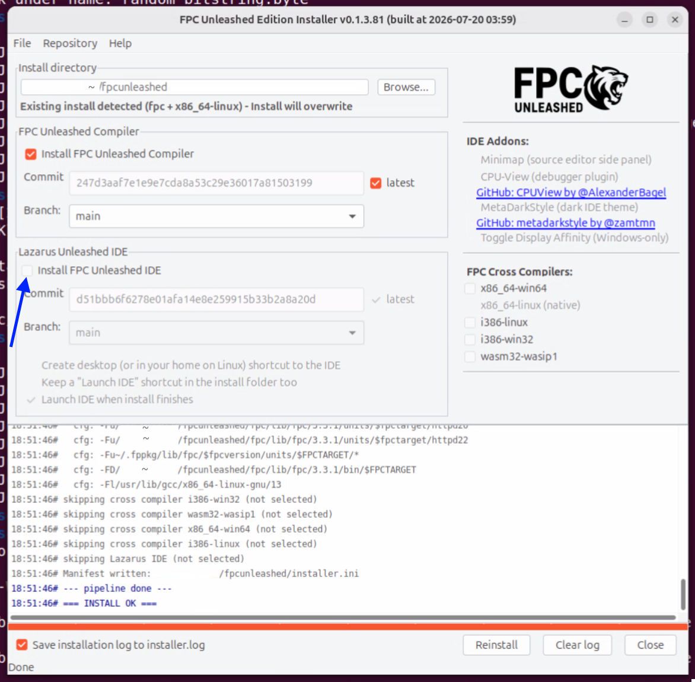

# Free Pascal

Profile of [Niklaus Wirth](http://pascal.hansotten.com/niklaus-wirth/) (1934-2024), the inventor of Pascal and other programming languages.

<br/>

---

Table of contents:

- [Free Pascal](#free-pascal-1)
- [Installation tips](#installation-tips)
- [Extended Pascal according to ISO 10206](#extended-pascal-according-to-iso-10206)
- [Random seed with leveraging the Address Space Layout Randomization (ASLR)](#random-seed-with-leveraging-the-address-space-layout-randomization-aslr)
- [Microbenchmark program: speed part in different Free Pascal modes](#microbenchmark-program-speed-part-in-different-free-pascal-modes)
- [Free Pascal, Unleashed](#free-pascal-unleashed)

---

## Free Pascal

https://www.freepascal.org/

https://gitlab.com/freepascal.org/fpc

Free Pascal supports:

- Objective-Pascal to access the Mac OS X system framework, which usually happens with Objective-C
- Object Pascal

..for example.

Also see: [What is Free Pascal (FPC)?](https://www.freepascal.org/faq.var#WhatIsFP)

Free Pascal is shipped with **a lot of documentation** inside the _doc-pdf.tar.gz_ file (with 8 PDF files)
inside tarball file _fpc-3.2.2.x86_64-linux.tar_ (as of 2026-07-17) from here: https://www.freepascal.org/down/x86_64/linux-hungary.html,
or online from here: https://www.freepascal.org/docs.html

The starting document for me was the **User’s Guide** for Free Pascal (PDF): https://downloads.freepascal.org/fpc/docs-pdf/user.pdf

Self-hosted Free Pascal supports a lot of platforms, including for example iOS.

The Free Pascal compiler is supporting these modes:

compiler switch | description
--- | ---
-Mfpc            | Free Pascal dialect (default)
-Mobjfpc         | **FPC mode with Object Pascal support**: I'm using this mode to be near my (modern) [Modula-3 implementation](https://github.com/practicalcomputerscience/MicrobenchmarkGPHLlanguages/blob/main/03%20-%20source%20code/01%20-%20imperative%20languages/Modula-3/random_streams_for_perf_stats_Main.m3)
-Mdelphi         | Delphi 7 compatibility mode
-Mtp             | TP/BP 7.0 compatibility mode
-Mmacpas         | Macintosh Pascal dialects compatibility mode
-Miso            | ISO 7185 mode
-Mextendedpascal | ISO 10206 mode for Extended Pascal: Free Pascal still doesn't fully support it
-Mdelphiunicode  | Delphi 2009 and later compatibility mode

<br/>

BP = Borland Pascal

TP = Turbo Pascal: https://en.wikipedia.org/wiki/Turbo_Pascal

<br/>

Free Pascal comes with a text version of an Integrated Development Environment (IDE), a graphical version exits with [Lazarus](https://www.lazarus-ide.org/) for example.

<br/>

### Installation tips

I just ran the _./install.sh_ script of the (unzipped) tarball file _fpc-3.2.2.x86_64-linux.tar_ as seen here: https://www.freepascal.org/download.html with my normal Linux user.

It will ask the user a couple of questions for the desired configuration. I installed Free Pascal into my home directory.

Then I added line _export PATH="$HOME/fpc-3.2.2/bin:$PATH"_ to my _~/.bashrc_ configuration file, which I then activated with: _$ source ~/.bashrc_

A first version test after installation:

```
$ fpc -V
Free Pascal Compiler version 3.2.2 [2021/05/16] for x86_64
Copyright (c) 1993-2021 by Florian Klaempfl and others
...
$
```

Free Pascal can also be installed like this in (Ubuntu) Linux: _$ sudo apt install fp-compiler-3.2.2_, or in its text based IDE version: _$ sudo apt install fp-ide-3.2.2_

Following the User’s Guide, I compiled and ran a _Hello world_ program:


```
$ cp $HOME/fpc-3.2.2/share/doc/fpc-3.2.2/examples/text/hello.pp .
$ cat hello.pp
{
    This file is part of the Free Pascal run time library.
    Copyright (c) 1993-98 by the Free Pascal Development Team
...
 **********************************************************************}

program hello;

  begin
     writeln('Hello world');
  end.

$ fpc hello
Free Pascal Compiler version 3.2.2 [2021/05/16] for x86_64
Copyright (c) 1993-2021 by Florian Klaempfl and others
Target OS: Linux for x86-64
Compiling hello.pp
Linking hello
21 lines compiled, 0.0 sec
$ ./hello
Hello world
$
```

<br/>

This compiler command is interesting: it shows "a list of supported FPU (Floating-Point Unit) instruction sets", which are actually SIMD (Single Instruction, Multiple Data) instruction set extensions to the x86 instruction set architecture for microprocessors from Intel and AMD: https://en.wikipedia.org/wiki/List_of_x86_SIMD_instructions

```
$ fpc -if
SSE64
SSE3
SSSE3
SSE41
SSE42
AVX
AVX2
$
```

<br/>

### Extended Pascal according to ISO 10206

Free Pascal's support of Extended Pascal according to [ISO/IEC 10206:1991](https://www.iso.org/standard/18237.html) is still minimal: https://gitlab.com/freepascal.org/fpc/source/-/work_items/32549

Many years ago there was still GNU Pascal around, which claimed to support "most of ISO 10206 Extended Pascal": https://www.gnu-pascal.de/gpc/h-about.html#lang

However, it's nowadays a tinkering job to get GNU Pascal running in a modern 64-bit Linux system: https://github.com/hebisch/gpc, so, I don't do it.

However, in ISO 10206 mode (Extended Pascal), Free Pascal has the required _TimeStamp_ type and _GetTimeStamp_ procedure implemented, which serves as a simple, random seed:

```
t            : TimeStamp;
...
  GetTimeStamp (t);
  x[0] := (t.Second + t.Minute + t.Hour + t.Day + t.Month + t.Year) mod (m - 2) + 1;
```

<br/>

### Random seed with leveraging the Address Space Layout Randomization (ASLR)

The [ISO 7185 program version](./random_streams_for_perf_stats_iso7185.pp) cannot access (Linux) system resources, and thus not reading a time value.

So, how to get then a somehow random seed?

Google AI helped me out with leveraging the Address Space Layout Randomization (ASLR), a concept also implemented many years ago in Linux: https://en.wikipedia.org/wiki/:

```
procedure ASLR_seed(var ResultSeed: integer);
type
  IntPtr = ^integer;

  { An ISO-compliant variant record maps different types to the same RAM bytes }
  EntropyBridge = record
    case boolean of
      true:  (PtrValue: IntPtr);
      { On 64-bit systems, a pointer fits across two 32-bit integers }
      false: (RawBytes: array[1..2] of integer);
  end;
var
  Bridge: EntropyBridge;
  Seed: integer;

begin
  { 1. Dynamically allocate a variable on the heap }
  { ASLR will assign this variable a completely unpredictable address }
  new(Bridge.PtrValue);

  { 2. Read the address out using the overlayed integer array variant }
  { This safely captures the random address bits without unsafe type casting }
  Seed := Bridge.RawBytes[1] + Bridge.RawBytes[2];

  { 3. Dispose of the dynamic variable safely }
  dispose(Bridge.PtrValue);

  { Enforce a clean, positive seed range }
  if Seed < 0 then
    ResultSeed := -Seed
  else if Seed > 0 then
      ResultSeed := Seed
  else
    ResultSeed := 31415;  { Fallback constant }
end;
```

<br/>

So, the only two differences between my [ISO 7185](./random_streams_for_perf_stats_iso7185.pp) and [ISO 10206](./random_streams_for_perf_stats_iso10206.pp) implementations are that:

- procedures _Integer_to_bin_string_ and _Integer_to_hex_string_ became functions in the ISO 10206 version, and that
- the ISO 10206 version uses the _GetTimeStamp_ procedure for a random seed, instead of leveraging Address Space Layout Randomization

<br/>

### Microbenchmark program: speed part in different Free Pascal modes

Free Pascal mode | compiler directives in source code | mean execution time measured with _$ multitime -n 10_ | string building | comment
--- | --- | --- | --- | ---
ISO 7185 "Pascal" | {$mode iso} | 16 milliseconds | C-style: writing characters of individual strings into an initially sized array of characters of the one, big string | 
ISO 10206 "Extended Pascal" | {$mode extendedpascal} | 14 milliseconds | C-style | Free Pascal still doesn't fully support this mode
Free Pascal (fpc) | {$mode fpc}{$H+} | 17 milliseconds | appending individual strings of type _array of char_ to the one, big string of type _String_ | this is Free Pascal's default dialect
Object Free Pascal | {$mode objfpc}{$H+}{$M+} | 16 milliseconds | appending individual strings of type _String_ to the one, big string of type _TStringStream_ | generally using some Delphi extensions, while retaining some Free Pascal constructs
Free Pascal, Unleashed | {$mode unleashed}{$H+}{$M+} | 14 milliseconds | same like in Object Free Pascal |

- _$H+_: _$LONGSTRINGS ON_: strings behave as AnsiString's, that is dynamically allocated with virtually unlimited size
- _$M+_: _$TYPEINFO ON_: generate run time type information (RTTI) for classes

<br/>

It's a pitty that Free Pascal still isn't supporting the ISO 10206 "Extended Pascal" dialect more. Apparently, demand for it is just too low.
I think that it could be another alternative for low-level systems programming, with the advantage of not going first through a transpilation to C code like the gm2 compiler for Modula-2 is doing it: [How to write fast Modula-2 programs](https://github.com/practicalcomputerscience/MicrobenchmarkGPHLlanguages/tree/main/03%20-%20source%20code/01%20-%20imperative%20languages/Modula-2#how-to-write-fast-modula-2-programs)

However and even though, the gm2-based Modula-2 implementation is the clear execution speed leader, ahead of the Free Pascal implementations, and then the Oberon-2 (with its own virtual machine of the Oxford Oberon-2 Compiler) and idiomatic, high-level Critical Mass Modula-3 implementations.

It's also remarkable that the execution time of both dialects that use advanced string types, Free Pascal and Object Free Pascal, stays pretty low, a concept which doesn't work in Modula-2 with a gcc backend in version 13 according to my tests.

<br/>

## Free Pascal, Unleashed

[FPC Unleashed](https://github.com/fpc-unleashed/freepascal#fpc-unleashed) has been forked from Free Pascal and is expanding the Object Free Pascal mode (_objfpc_) mode "with powerful enhancements": [Unleashed Mode](https://github.com/fpc-unleashed/freepascal#unleashed-mode):

- I didn't install the Lazarus Unleashed fork, because that installation didn't work on my usual testing system, even though I installed the pre-requisites: [Linux host requirements](https://github.com/fpc-unleashed/installer#linux-host-requirements) (*)
- I installed Free Pascal, Unleashed on a different Ubuntu 24 LTS system, because I got this error when compiling in my usual testing system with still the "normal" FPC installed: _Fatal: Can't find unit system used by Main_

As recommeneded, I used the Linux installer file _installer_linux_x86_64_ from here (*), then did a _$ chmod 755 installer_linux_x86_64_, and executed it (_$ ./installer_linux_x86_64_) without the Lazarus Unleashed IDE:



<br/>

Then, I only slightly modified the original [random_streams_for_perf_stats.pp](./random_streams_for_perf_stats.pp) program for the Object Free Pascal mode to [random_streams_for_perf_stats_unleashed.pp](./random_streams_for_perf_stats_unleashed.pp) for the Free Pascal, Unleashed mode:

```
program Main;

{$mode unleashed}{$H+}{$M+}  // 2026-07-20
...
```

..and compiled it like this:

```
$ fpc -Munleashed random_streams_for_perf_stats_unleashed.pp
```

<br/>

Program _random_streams_for_perf_stats.pp_ is just too short to make use of Free Pascal, Unleashed's features.
I did this with the [full microbenchmark program](./random_bitstring_and_flexible_password_generator.pp),
which I modified to [random_bitstring_and_flexible_password_generator_unleashed.pp](./random_bitstring_and_flexible_password_generator_unleashed.pp) with these new features:

- [Multi-Variable Initialization](https://github.com/fpc-unleashed/freepascal#multi-variable-initialization)
- [Statement Expressions, If expression](https://github.com/fpc-unleashed/freepascal#if-expression)
- [String Interpolation](https://github.com/fpc-unleashed/freepascal#string-interpolation)

However, and as I've noticed, not everything that goes through compilation will work, but that is also true for Free Pascal.

That makes now only 119 source lines of code instead of 127 of program _random_bitstring_and_flexible_password_generator.pp_.

Free Pascal, Unleashed is still a very young fork, only publicly announced in March 2026: https://forum.lazarus.freepascal.org/index.php/topic,73678.0.html, but I already think that it can truly advance of what has been once started with Object Free Pascal.

<br/>

## Blaise Pascal Compiler

https://github.com/graemeg/blaise

I downloaded the pre-compiled binary _blaise-v0.13.0-linux-x86_64.tar.gz_ from here: https://github.com/graemeg/blaise/releases/tag/v0.13.0

I unpacked this tarball file and expanded my _~/.bashrc_ configuration file like this (activate it after changes with _$ source ~/.bashrc_):

```
export BLAISE_RTL_SRC="$HOME/scripts/Blaise_Pascal_Compiler/blaise-v0.13.0-linux-x86_64/rtl-src"
export PATH="$HOME/scripts/Blaise_Pascal_Compiler/blaise-v0.13.0-linux-x86_64:$PATH"
```

Building the Blaise Pascal Compiler from sources takes some more effort, because this compiler is using [PasBuild](https://github.com/graemeg/pasbuild#pasbuild), which needs a working Free Pascal Compiler: https://github.com/graemeg/pasbuild#6-requirements

Building and running the _hello.pas_ example worked like this:

```
$ sudo mkdir /rtl  # do this only once
$ sudo chmod 777 /rtl  # do this only once
$ blaise --source ./blaise-v0.13.0-linux-x86_64/hello.pas --output hello
$ ./hello
Hello from Blaise!
$
```

tbd


<br/>

##_end
