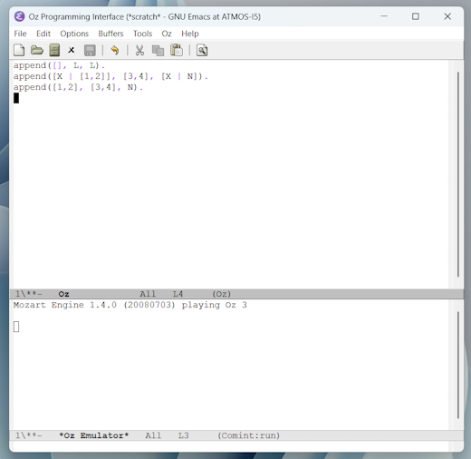

2025-12-02: work in progress

# Oz

Development and execution environment **Mozart**:

- http://mozart2.org/
- https://github.com/mozart/mozart2/tree/master

GUI = Graphical User Interface

<br/>

> [!IMPORTANT]
> Current Mozart version 2.0.1 from 2018 is too buggy to do anything advanced. It's anyway marked as: "The status of Mozart 2 is currently _alpha quality_. It is not ready for production, ...".
> 
> Unfortunately, it's also pratically impossible to build from sources former version 1.4.0 from 2008 in a **modern** Linux system, not to mention any older version of the Mozart-Oz programming system.
> 
> However, what is working according to my tests, is **version 1.4.0 in Windows 11**. I tested it successfully with a couple of old or even very old examples, official ones and others.

Mozart 2 has been designed to fully support today's multicore processors, see below at [Mozart's virtual machines](#mozarts-virtual-machines).

<br/>

This means I cannot really benchmark the map coloring problem of Germany in its Oz version against the results of the various Prolog systems: [The TL;DR execution speed diagram](https://github.com/practicalcomputerscience/MicrobenchmarkGPHLlanguages/tree/main/03%20-%20source%20code/04%20-%20logic%20programming/Prolog#the-tldr-execution-speed-diagram), because my "official" benchmarking system will stay in the same PC with Ubuntu 24 LTS.

<br/>

So, to advance, install Mozart version 1.4.0 for Windows 11 from installation file _Mozart-1.4.0.20080704.exe_ from here: https://sourceforge.net/projects/mozart-oz/files/v1/1.4.0-2008-07-04-windows/

Also install (latest) version of GNU Emacs for Windows, the (usual) GUI for Mozart: https://www.gnu.org/software/emacs/download.html

<br/>

Oz cheat sheet from 2019: https://github.com/alhassy/OzCheatSheet/blob/master/CheatSheet.pdf

<br/>

At the moment, Oz, now in Version 3, and Mozart feel like a big, almost abandoned construction site with numerous dead links in the web,
here for example for Oz version 2: https://www.ps.uni-saarland.de/oz2/documentation/, or links to outdated but still useful documentation (https://www.mozart-oz.org/documentation/); useful since also current Mozart version 2.0.1 is still using many old parts.

Therefore, I often looked into its **GitHub repository** to see what functions are available and how to use them, like here for [lists](https://github.com/mozart/mozart2/blob/master/lib/main/base/List.oz) for example, though this is for Mozart 2 and not Mozart 1.4.0, what I'm using here: http://mozart2.org/mozart-v1/doc-1.4.0/index.html

For Oz's **terminology** I also had a look into "A Tutorial of Oz 2.0" (+) from 1996 by Seif Haridi: https://www.researchgate.net/publication/2408237_Tutorial_of_Oz_2

---

Table of contents:

- [Concepts of Oz](#concepts-of-oz)
- [Installation and usage tips](#installation-and-usage-tips)
- [Functors, curly brackets and scoping in Oz](#functors-curly-brackets-and-scoping-in-oz)
- [Strings in Oz](#strings-in-oz)
- [Mozart-Oz is not working in a modern Linux system out of the box](#mozart-oz-is-not-working-in-a-modern-linux-system-out-of-the-box)
- [The GNU Multiple Precision Arithmetic Library (GMP)](#the-gnu-multiple-precision-arithmetic-library-gmp)
- [Mozart's virtual machines](#mozarts-virtual-machines)
- [From the GUI to the command shell (terminal)](#from-the-gui-to-the-command-shell-terminal)
- [Map coloring of Germany - Oz versus Python](#map-coloring-of-germany---oz-versus-python)
- [Microbenchmark program in Oz - not complete](#microbenchmark-program-in-oz---not-complete)
- [Oz versus Python in Windows 11 - speed part](#oz-versus-python-in-windows-11---speed-part)
- [The future of Oz?](#the-future-of-oz)

<br/>

---

## Concepts of Oz

Maybe this computer programming book of two of the later developers became more famous:


from: https://webperso.info.ucl.ac.be/~pvr/book.html

..than the language itself.

Oz feels to me like that its supported programming paradigms are existing in parallel (nowadays), which stands in contrast to layered [Mercury](https://github.com/practicalcomputerscience/MicrobenchmarkGPHLlanguages/tree/main/03%20-%20source%20code/04%20-%20logic%20programming/Mercury) for example, where logic programming is the clear bottom layer.

Though the Mozart-Oz pair has been later marketed as a "Multi-paradigm Programming System" (https://archive.fosdem.org/2007/slides/lightningtalks/MozartOz.pdf), it has its clear roots in logic programming:

> We give the history of Oz as it developed from its origins in logic programming, starting with Prolog, followed by concurrent logic programming and constraint logic programming, and leading to its two direct precursors, the concurrent constraint model and the Andorra Kernel Language (AKL). 

(*) from: "A History of the Oz Multiparadigm Language", 2020, by its initial and main developers: https://www.ps.uni-saarland.de/Publications/documents/vanRoyHaridiSchulteSmolka2020.pdf, a very good source

(**) also see "Logic Programming in Oz with Mozart" by Peter Van Roy from 1999: http://mozart2.org/publications/abstracts/lpinoz99.html, which still can be searched as a ready PDF file in the web:

> This short tutorial explains how to do Prolog-style logic programming in Oz. ... The Oz computation model subsumes both search-based logic programming and committed-choice (concurrent) logic programming with deep guards.

KÖRNER P, LEUSCHEL M, BARBOSA J, et al. ([Fifty Years of Prolog and Beyond](https://www.cambridge.org/core/journals/theory-and-practice-of-logic-programming/article/fifty-years-of-prolog-and-beyond/3A5329B6E3639879301A6D44346FD1DD), 2022) sort Oz into the group of **Committed-choice Languages**, which are:

> ...logic languages supporting “committed choice” where only the first clause whose guard succeeds is executed, instead of the multiple execution paths supported by Prolog.

<br/>

This already, although indirectly, answers this question: Is Oz a Prolog system?

No, it's not. A direct test of the two relevant Prolog predicates in Mozart's GUI environment (from here for example: [Picat example](https://github.com/practicalcomputerscience/MicrobenchmarkGPHLlanguages/tree/main/03%20-%20source%20code/04%20-%20logic%20programming/Picat#some-concepts-of-picat)) shows this too:



No "Oz Browser" windows pops up here with some results (see below for a counter case).

<br/>

## Installation and usage tips

Oz has, or better to say had, a strong focus on teaching computer programming, and doing this with means of a GUI, or more specifically with commands in menu tree "Oz" of the **GNU Emacs** text editor.

However, what works, here example [rainy.oz](https://github.com/mayc2/proglang/blob/master/examples/rainy.oz), without any problems in **Windows** (11) with Mozart version 1.4.0:


..doesn't work with latest Mozart version 2.0.1 from 2018 in **Linux**, here ready Debain package _mozart2-2.0.1-x86_64-linux.deb_ from: https://github.com/mozart/mozart2/releases/tag/v2.0.1, which can easily be installed with Ubuntu's App Center for example; the app can then be found as the "Mozart Programming System":


To replay this example, just copy all the source code from file _rainy.oz_ and past it into the upper text buffer of the "Oz Programming interface". Then this **application** can be executed with mouse clicks or Emacs keyboard commands:

- mouse: for example, click on menu bar item "Oz" and then "Feed Buffer"
- keyboard: for example, press key [F10] to activate the menu bar. Then use the arrow right key to open the "Oz" menu tree. There scroll down to "Feed Buffer" and press [ENTER]

Now the "Oz Browser" window should pop up as shown above for **Windows**. 

### Functors, curly brackets and scoping in Oz

The _rainy.oz_ example, without extra declarations in the source code, directly uses the Oz library, or _**functor**_, [Search](https://github.com/mozart/mozart2/blob/master/lib/main/cp/Search.oz), a library which would be a good help to find solutions of a Constraint Satisfaction Problem (CSP), like the map coloring problem. From (*):

> A functor is a module specification that defines a function whose arguments are modules and whose result is a new module. Instantiating a functor means to call this function with the correct modules as inputs. All libraries were then rewritten to become modules. A running application is a graph of modules.

"Functors are comparable to Java packages.", see from (~) below.

<br/>

Here's (*) also something about the rather unusual curly brackets ("braces": {}) for functions and procedures in Oz:

> The syntax design was a difficult issue because of the project’s ambition: we aimed to support as many programming paradigms as possible. This put a strong constraint on the syntax: it needed to
support all paradigms in a clean and factored manner. For example, we used parentheses for records and brackets for lists; this left us with braces for functions and procedures. This is an important
lesson for future language designers: be especially careful about syntax, and be prepared to make big changes in the syntax when evolving the system.

- parentheses: () -- for records in Oz, which are structured compound entities with a label and some number of components or arguments, which are Feature:Field pairs; records are **tuples** when the features are omitted
- brackets: [] -- for lists in Oz

<br/>

**Scoping** is also not so easy in Oz from my point of view. After elaborate experimentation I found out that this style with the consequential usage of keyword _local_ is the easiest for me to define functions and procedures. Although, it's most probably not the shortest solution:

```
fun {My_func X Y}  % fun could also be a proc here with Y, or ?Y to mark the output more visually, holding the result
    local
        fun {Func1 ...}
        ...
        end  % of Func1

        fun {Func2 ...}
        ...
        end  % of Func2

        Var1 Var2 Var3 ...
    in
       Var1 = ... {Func1 ...} ...
       Var2 = ... {Func2 ...} ...
       ...
       Var3  % return value of My_func
    end  % of in
end  % of fun or proc
```

<br/>

Another good source of Oz knowledge is the PhD thesis of Tobias Mueller: [Constraint Propagation in Mozart](https://publikationen.sulb.uni-saarland.de/bitstream/20.500.11880/25775/1/TobiasMueller_ProfDrGertSmolka.pdf) from 2001 in English language, who was also one of the authors of the [FD functor](https://github.com/mozart/mozart2/blob/master/lib/main/cp/FD.oz), FD for Finite Domain, also called FD library, see below.

<br/>

## Strings in Oz

Strings in Oz have been a real pain point when I started to implement my own [microbenchmark program in Oz](./random_streams_for_perf_stats.oz).

I was desperately looking for a way to make a simple but concatenated string and show this string in the terminal, like in all the other programming languages I've tested so far. But this is practically impossible in Oz according to my experiments. Therefore, this [microbenchmark implementation](./random_streams_for_perf_stats.oz) so far is the only one where I cannot show the two big strings on the console for testing purposes, and before writing them to files. The later functionality works, but in an (imperative) for-loop (could be also recursively functional I guess), where each "atom" is individually, and "correctly" without any extra characters, appended to its file!

It was finally _Figure 26: The class Point_ in the **A Tutorial of Oz 2.0** from 1996 (+) which opened me the eyes with its last function call to show a "string" in the Oz Browser:

```
{Browse {StringToAtom{VirtualString.toString "point at ("#@x#" , "#@y#")"}}}
```

The _#_ operator, or **common infix tuple-operator**, see from here for example: http://mozart2.org/mozart-v1/doc-1.4.0/tutorial/node3.html, is practically the only tool for string concatenation in Oz. The @ operator is for showing the value of a variable.

Here's a little Oz program based in this concept to be entered in the upper text buffer of the Oz-extended Emacs editor, and then be submitted into the "Feed Buffer" command under the Oz menu (see also above):

```
declare
A = "Hello"  % this is a virtual string, a list made of character codes
B = ", World!"  % this is a second virtual string
C = A#B  % C is then a concatenated virtual string
{Browse {StringToAtom {VirtualString.toString C}}}  % this nested function first converts virtual string C into a string,
% which is then converted into an atom, which is then being browsed
{Browse {VirtualString.toString C}}  # here the conversion into an atom is omitted, and only a list of codepoints is being browsed
```

..and this is how the results look like in the Oz Browser:


Be also aware that there are no built-in functions in Oz to easily convert between lists, (virtual) strings and arrays.

[Virtual strings in Oz](http://mozart2.org/mozart-v1/doc-1.4.0/op/node4.html#section.data.virtualstrings):

I see it now layered like this for example:

- top layer: virtual strings for coding
- middle layer: strings (not really "visible")
- bottom layer: atoms for visible results

<br/>

## Mozart-Oz is not working in a modern Linux system out of the box

Building Mozart version 1.4.0 from 2008 from sources, that is file _mozart-1.4.0.20080704-src.tar.gz_ from here: https://sourceforge.net/projects/mozart-oz/files/v1/1.4.0-2008-07-02-tar/, in Ubuntu 24 LTS, or any other modern Linux system, fails out of the box.

A Mozart installation in Linux requires these components as well, but they are all easy to install:

- GNU Make: _$ sudo apt install make_
- gcc etc.: _$sudo apt install build-essential_
- GNU flex: _$ sudo apt install flex_
- GNU bison: _$ sudo apt install bison_
- GNU Emacs: _$ sudo apt install emacs_

#### The GNU Multiple Precision Arithmetic Library (GMP)

The reason for this failure is the "version hell" in connection with the needed GNU Multiple Precision Arithmetic Library (GMP): https://gmplib.org/, on which the Mozart programming system heavily relies on.

Any old GMP version, that is 2 or 3, which was meant to be used back in 2008 with Mozart v1.4.0, cannot be installed in a modern Linux system anymore (out of the box), and installing a more modern GMP version doesn't work with Mozart's v.1.4.0 Linux installation scripts (out of the box), here specifically with file _aclocal.m4_, written in 2008. (Be careful not to mix this manually written configuration file with GMP's automatically generated _aclocal.m4_ configuration files!)

And I'm not willing to fix this file or any other Mozart configuration files to make Mozart version 1.4.0 work with an (old) GMP version I was able to install.

<br/>

Anyway, I installed current GMP version 6.3.0, that is file _gmp-6.3.0.tar.gz_, from here: https://ftp.gnu.org/gnu/gmp/, because the GMP version mentioned during Mozart's configuration process (_$ ./configure_), that is GMP version 4.1.2, cannot be installed anymore in Ubuntu 24 LTS (or any other modern Linux system most probably). However, also this old GMP version provides useful information (which has been deleted or rearranged in later versions).

Yet, you may have a look into GMP's text files named _INSTALL_, located in extracted installation directory _gmp-X.X.X_, for more background information.

Do this in GMP's extracted installation directory:

```
$ ./configure
...
$ make -j 4  # 4 CPU's used to accelerate the make process
...
$ sudo make install
...
$ make check  # this check must not fail!
...
$
```

With this procedure, GMP has been installed into directory: _/usr/local/lib_, and header file _gmp.h_ into directory: _/usr/local/include_ (as its lonely file in a fresh Ubuntu installation.)

Another good, practical test for a successful GMP installation is this: I copied the second source code example (under "An experienced GMP user might write") from the _INSTALL_ file of GMP version **4.1.2** and successfully built a C program from it: [gmp_test_example.c](./gmp_test_example.c)

To do this, you don't have to be located in GMP's installation directory anymore, because you just hopefully installed a working GMP version!

So, I changed back to my Oz working directory to do these tests (option _-g_ is for compiling with debugging information):

```
$ gcc -g gmp_test_example.c -o gmp_test_example -lgmp
$ ./gmp_test_example 999999999999999999999 999999999999999999999
999999999999999999998000000000000000000001
$
```

This works too:

```
$ gcc -Wall -Ofast gmp_test_example.c -o gmp_test_example -lgmp
$ ./gmp_test_example 999999999999999999999 999999999999999999999
999999999999999999998000000000000000000001
$
```

You may also check a GMP installation with (the Debian) package manager command _dpkg_:

```
$ dpkg -l | grep gmp
ii  libgmp10:amd64  2:6.3.0+dfsg-2ubuntu6.1  amd64  Multiprecision arithmetic library
$
```

So, with using the GNU Multiple Precision Arithmetic Library, "Oz provides arbitrary long integers. That means the size of an integer is just limited by the memory size. Integers with a size of up to 28 bits are stored in registers, if an integer is larger than 28 bit, it gets always loaded from main memory,"; see from: [The Oz Programming Language](http://cl-informatik.uibk.ac.at/teaching/ss15/bob/reports/ss15-BV.pdf), Seminar Report, Benjamin Vettori, 2015 (~)

<br/>

GMP works, but the Mozart v.1.4.0 installation not:

_./configure_ can be used with option _--with-gmp=\<dir\>_, see in Mozart's _aclocal.m4_ file, to provide the _configure_ command with location information of GMP's library and header. However, according to my tests this option just isn't working anymore as intended many years ago:

```
$ ./configure
...
checking for --with-gmp... yes
checking for gmp.h... yes
checking for __gmpz_init in -lgmp (default)... yes
checking gmp version is at least 2... no
configure: warning: GNU MP version too old
configure: error: 
The GNU Multiple Precision Arithmetic Library (gmp)
version 2 or higher is required
to build the system.  It can be retrieved from:

	ftp://ftp.gnu.org/pub/gnu/gmp/

The latest version at this time is 4.1.2 and is available packaged as the following archive:
...
configure: error: ~/scripts/Oz/mozart-1.4.0.20080704-src/mozart-1.4.0.20080704/platform/emulator/configure failed for emulator
configure: error: ~/scripts/Oz/mozart-1.4.0.20080704-src/mozart-1.4.0.20080704/platform/configure failed for platform
$
```

This is my end here for a Mozart-Oz programming system in a Linux system. For a change, I will continue with **Windows** (11) from now on.

<br/>

#### Mozart's virtual machines

Maxime Istasse's master thesis from 2017, [An Oz implementation using Truffle and Graal](https://thesis.dial.uclouvain.be/entities/masterthesis/df736f1e-0021-42f2-b484-f86538a8150b) may provide interesting insights into Mozart's inner workings:

> In the meantime, the Oz programming language [14] has almost exclusively been executed on dedicated Virtual Machines (VMs). Mozart 1 [15], though highly optimized, now suffers from it because the hardware has evolved. Mozart 2 has been an attempt at making a new dedicated VM adapted to today’s hardware, but cannot be claimed as complete yet.

Another technical source may be Benoit Daloze's master thesis [Extending Mozart 2 to support multicore processors](http://mozart2.org/publications/abstracts/daloze-thesis.html) from 2014:

> The concurrent programming models of Oz have supported lightweight threads for ages. ... Nowadays, processors are getting more and more cores, or computer are having more and more
processors and the model of lightweight threads does not take advantage of this computational power. ... In current operating systems, a process needs to use multiple operating system threads to actually use multiple cores. This kind of threads is much harder to use, not deterministic and using them properly is so complicated that we tend to avoid them as much as we can.

<br/>

## From the GUI to the command shell (terminal)

The GUI based approach makes it not so easy to do command shell based software development like in a typical Prolog system. Many Oz examples from tutorials and documents are not working when using Mozart-Oz command shell tools. The definition of variables, procedures and functions (which are "syntactic sugar for procedures", see from (~) above) in an Oz source code file, that is a module, works differently than many textbook examples.

It took me a while, but finally I found a solution with the help of Big AI.

After an installation of the Mozart programming system, also shell commands to start Mozart tools are available without extra configurations, though the question is: how to start an Oz compiler or interpreter from a command shell, like in a Prolog system for example?

After a Windows installation, I added these two enviroment variables as a Windows user ([Win]+R --> _sysdm.cpl_ --> "Advanced" --> "Enviroment Variables..."):

- new: OZEMACS: runemacs.exe
- extended PATH: C:\Program Files\Emacs\emacs-30.1\bin

So, also Windows users need to install the Emacs editor: https://www.gnu.org/software/emacs/download.html

When you now enter in the Windows Command Prompt: _>oz_, the Emacs editor with menue tree "Oz" should pop up like shown above.

<br/>

However, at this point we want to have a "usual" source code file, like for example for the [Australian map](./graph_4coloring_Australia_Win11_for_cmd.oz) as a starter problem to solve, which is making use of functors Search and **FD** for the [Finite Domain functor](https://github.com/mozart/mozart2/blob/master/lib/main/cp/FD.oz):

```
functor
import
  System
  Application
  FD       % Finite Domain functor in lib/main/cp/FD.oz
  Search   % Search functor in lib/main/cp/Search.oz

define
    proc {Color ?MapColor}  % ? symbol to denote that MapColor is an output argument
           NT
           QL
           NSW
           VIC
           SA
           WA
           TAS
    in
       map(
           % map() is just the name of an Oz record:
           % label(feature1:value1 feature2:value2)
           % from: https://strasheela.sourceforge.net/strasheela/doc/Basics-1.html
           nt  : NT
           ql  : QL
           nsw : NSW
           vic : VIC
           sa  : SA
           wa  : WA
           tas : TAS
          ) = MapColor

       {Record.forAll MapColor proc {$ Country} Country :: 1#4 end}
                              % $ transforms a statement to an expression
                              % which can be used to mimic anonymous procedures;
                              % the :: operator imposes a basic finite domain,
                              % here with a finite set of integers 1..4 (inclusive);
                              % # is a pairing symbol
       WA  \=: NT
       WA  \=: SA
       NT  \=: SA
       NT  \=: QL
       SA  \=: QL
       SA  \=: NSW
       SA  \=: VIC
       QL  \=: NSW
       VIC \=: NSW
       TAS \=: VIC
       {FD.distribute ff MapColor}  % branching and exploration algorithm ff = first-fail ??
                                     % I looked this up from Picat's CP module (for Constraint Programming)
    end

    ColorSolutions = {Search.base.all Color}

    {System.showInfo "number N of different solutions = "#{Value.toVirtualString {Length ColorSolutions} 0 0}}

    FirstSolution | _ = ColorSolutions

    ReverseColorSolutions = {Reverse ColorSolutions}
    LastSolution | _ = ReverseColorSolutions

    {Application.exit 0}
end
```

The role model for this app was platform test file _**color.oz**_ from here: https://github.com/mozart/mozart2/blob/master/platform-test/fd/color.oz, which then only had to be mixed with the important ideas in the little _rainy.oz_ example.

Honestly, I would have not been able to write source code file _graph_4coloring_Australia_Win11_for_cmd.oz_ within an acceptable amount of time without discovering _color.oz_, even in the age of Big AI.

As you can see at the top of this source code, we create our own _functor_ for this app. Also the _declare_ statements, like one shown in the _rainy.oz_ example above, are gone.

Now you can compile this file in your Oz working directory in Windows:

```
>ozc -c graph_4coloring_Australia_Win11_for_cmd.oz
>
```

Distributable object file (.ozf) _graph_4coloring_Australia_Win11_for_cmd.ozf_ has been created during compilation, which can then be executed like this:

```
>ozengine graph_4coloring_Australia_Win11_for_cmd.ozf
number N of different solutions = 576

1st solution  = map(nsw:1 nt:1 ql:2 sa:3 tas:1 vic:2 wa:2)
...
Last solution = map(nsw:4 nt:4 ql:3 sa:2 tas:4 vic:3 wa:3)

>
```

Wow! :smile:

576 different solutions is the same and almost certainly correct result of [ALS Prolog](https://github.com/practicalcomputerscience/MicrobenchmarkGPHLlanguages/tree/main/03%20-%20source%20code/04%20-%20logic%20programming/Prolog#map-of-australia), though the color structures of the first and last solutions are different.

Command option _-x_ generates directly an "executable" Windows program:

```
>ozc -x graph_4coloring_Australia_Win11_for_cmd.oz
>graph_4coloring_Australia_Win11_for_cmd.exe
<same answer>
>
```

This ~.ozf file is also called "a compiled functor", see tool _ozmake_ below.

<br/>

## Map coloring of Germany - Oz versus Python

Here's Oz's implementation of the map coloring of Germany problem: [graph_4coloring_Germany_Win11_for_cmd.oz](./graph_4coloring_Germany_Win11_for_cmd.oz)

Now the question is: how good is this Oz program faring against another implementation on the same Windows platform? (Intel Core i5 14600K, Windows 11 Pro 64-bit, ASUS PRIME B760-PLUS)

In order to compare, I benchmarked both Python 3 solutions, the one with [backtracking](https://github.com/practicalcomputerscience/MicrobenchmarkGPHLlanguages/blob/main/03%20-%20source%20code/04%20-%20logic%20programming/Mercury/MapColoring_Germany.py), which has been artificially cut from over 15 seconds to 1.0 second below, and the one which uses the [python-constraint2 package](https://github.com/practicalcomputerscience/MicrobenchmarkGPHLlanguages/blob/main/03%20-%20source%20code/04%20-%20logic%20programming/Prolog/graph_4coloring_Germany-constraint.py):


I used this Windows PowerShell script for the execution time measurements: [Program_exe_time_measurement.ps1](./Program_exe_time_measurement.ps1)

So, under the given circumstances, Oz is doing slightly better than Python with a Constraint Programming package!

What is also noticeable, is the fact that running the Oz object file with the _ozengine_ yields a slightly faster program execution than running the Windows executable directly. My suspicion for this phenomenon is that running the Mozart generated ~.exe file needs some more time first to look up its execution environment. Because this ~.exe file is not freely portable as its file extension may suggest; it also needs the _ozengine.exe_ program to be executed. Mozart's (standard) Windows installation is adding this directory to environment variable _PATH_: _C:\Program Files (x86)\Mozart\bin_, a directory where _ozengine.exe_ and the other Mozart tools are located. Here are the two file sizes:

- _graph_4coloring_Germany_Win11_for_cmd.ozf_: 3,889 bytes ("Oz ozengine")
- _graph_4coloring_Germany_Win11_for_cmd.exe_: 9,521 bytes ("Oz executable")

Some of the Mozart tools, like _> ozmake.exe --help_ for "for building Mozart-based projects and for creating and installing Mozart packages", have long help pages.

<br/>

## Microbenchmark program in Oz - not complete

What I could have accomplished is the "speed part" of the Microbenchmark program in Oz: [random_streams_for_perf_stats.oz](./random_streams_for_perf_stats.oz)

Oz has no string builder, see also at [Strings in Oz](#strings-in-oz), but (imperative) [arrays](http://mozart2.org/mozart-v1/doc-1.4.0/tutorial/node11.html#label62) can be defined, where the individual elements can then be manipulated directly with procedure _put_, and read back with procedure _get_.

It was not possible for me the write the complete microbenchmark program with its user interaction in a terminal, because [Reading user input from the keyboard into a string on the console](https://github.com/practicalcomputerscience/MicrobenchmarkGPHLlanguages/tree/main/40%20-%20reading%20user%20input%20from%20the%20keyboard%20into%20a%20string%20on%20the%20console#reading-user-input-from-the-keyboard-into-a-string-on-the-console) seems to be impossible in Windows with Oz. Oz apparently was never meant to be used for this. I also haven't found any single (Linux) example in its [repository](https://github.com/mozart/mozart2), which may come close to a potential solution.

However, it may have worked in Linux many years ago, doing it indirectly with using a **Linux pipe**: [6 Running Processes](http://mozart2.org/mozart-v1/doc-1.4.0/op/node16.html#chapter.pipe):

> A frequent need in programming open applications is to start an operating system process from Oz and to send information to and receive information from the running process. For this purpose we provide a class Open.pipe.

See also: [6.1 Example: A Shell in Oz](http://mozart2.org/mozart-v1/doc-1.4.0/op/node17.html#section.pipe.shell)

In Linux, there's command [read](https://www.man7.org/linux/man-pages/man2/read.2.html), which may have been used for this purpose:

```
$ read name
Tim
$ echo "$name"
Tim
$
```

But since Oz is no longer working in modern Linux, this is also not an option.

<br/>

### Oz versus Python in Windows 11 - speed part

What I then could have done is a little benchmark for [Oz](./random_streams_for_perf_stats.oz) versus [Python](https://github.com/practicalcomputerscience/MicrobenchmarkGPHLlanguages/blob/main/03%20-%20source%20code/01%20-%20imperative%20languages/Python/random_streams_for_perf_stats.py) in the same Windows 11 PC. Here are the statistics:

programming language | mean of 10 runs in milliseconds | standard deviation in milliseconds
--- | --- | ---
Oz 1.4.0 with ozengine | 513 | 16.6
Python 3.13.9 + numpy-2.3.5 | 208 | 7.8

<br/>

By the way: the "normal" Python installation in Windows (11) is not very efficient (though I used it to be able to use the [PowerShell script](./Program_exe_time_measurement.ps1)). For better execution speeds (around 1/3 less execution times according to me experiments), take [Miniconda3 for Windows](https://www.anaconda.com/docs/getting-started/miniconda/install) (but then the PowerShell script is not working).

<br/>

## The future of Oz?

The short conclusion in [A History of the Oz Multiparadigm Language](https://www.ps.uni-saarland.de/Publications/documents/vanRoyHaridiSchulteSmolka2020.pdf) from 2020 doesn't sound optimistic:

> We hope that the ideas of this article will be an inspiration to future language designers.

Almost two years after the last update of the Mozart Compiler, this last statement could be interpreted as the quasi official obituary of Oz.

<br/>

##_end
