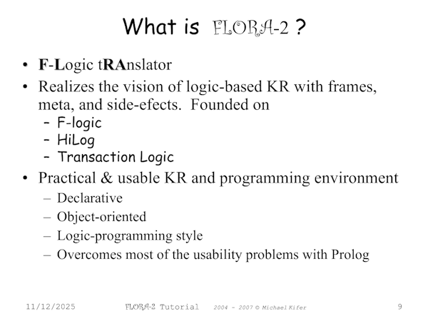

2025-11-12: work in progress

# ErgoAI: knowledge representation and reasoning

KRR = Knowledge Representation and Reasoning

https://github.com/ErgoAI

http://coherentknowledge.com/product-overview-ergoai-platform/

<br/>

---

Table of contents:

- [Installation tips](#installation-tips)
- [ErgoAI, XSB Prolog and Flora-2](#ergoai-xsb-prolog-and-flora-2)
- [Installation tips](installation-tips)
- [Socrates example](#socrates-example)
- [Map coloring problem with 3 colors and 4 states](#map-coloring-problem-with-3-colors-and-4-states)
- [Map coloring problem of Germany](#map-coloring-problem-of-germany)
- [](#)
- [](#)

<br/>

---

## ErgoAI, XSB Prolog and Flora-2

Like [ECLiPSe](https://github.com/practicalcomputerscience/MicrobenchmarkGPHLlanguages/tree/main/03%20-%20source%20code/04%20-%20logic%20programming/Prolog#eclipse---constraint-logic-programming-system), ErgoAI also features a graphical user interface (GUI): _ErgoAI reasoner can start either in the studio mode, as part of the ErgoAI Studio IDE (suitable for development), or as a command line application._, seen here at: [Starting the ErgoAI System](https://sites.google.com/coherentknowledge.com/ergoai-tutorial/ergoai-tutorial/home#h.p_ID_539).

[ErgoAI's FAQ's](https://docs.google.com/document/d/1J_ASpGjDwgqMDzNgB-hqQC3keA8sIMZIHHs8gmJXG04/edit?tab=t.0#heading=h.y2mxm6jqtd4v) say this about the relation of XSB Prolog and ErgoAI:

> XSB is a powerful and complex reasoning engine used by Ergo reasoner. XSB is very versatile and has many capabilities, but requires considerable expertise to use. Think of Ergo as a Cadillac sedan with its buttons and simple controls vs. XSB, an engine attached to a chassis and controlled by pulling multiple levers. Unless you are a mechanic who likes tinkering with complex engines, ErgoAI is a better option for you.

ErgoAI is a direct descendant of [Flora-2](https://flora.sourceforge.net/) as a view into this web page shows: https://sourceforge.net/projects/flora/files/FLORA-2/

Flora = F-Logic tRAnslator:



from the first part of the presentation from 2017: https://flora.sourceforge.net/tutorial/part1-foundations.ppt

TBD

<br/>

## Installation tips

I downloaded file _ergoAI_3.0.run_ from here: https://github.com/ErgoAI/.github/releases, and ran this file in a working directory for ErgoAI:

```
$ sh ergoAI_3.0.run
...
+++++ All is well: you can run ErgoAI in terminal mode via the script
+++++    "~/scripts/Prolog/ErgoAI/Coherent/ERGOAI_3.0/ErgoAI/runergo"
+++++ and with the Studio via
+++++    "~/scripts/Prolog/ErgoAI/Coherent/ERGOAI_3.0/runErgoAI.sh"
$
```

Do not run this installation script as root user (_sudo_), because such an installation won't work for the normal Linux user!

So, I started the console application as given like shown above:

```
$ ~/scripts/Prolog/ErgoAI/Coherent/ERGOAI_3.0/ErgoAI/runergo

ErgoAI Reasoner 3.0 (Philo) of 2023-05-01 (linux-gnu x64; rev: d934cd9)

For basic commands:  type  \help.  then <Enter>
Documentation:       https://github.com/ErgoAI

Current folder:      ~
ergo> \halt.

End XSB (cputime 0.23 secs, elapsetime 3.76 secs)
$
```

_\end._ instead of _\halt._ will only end the ErgoAI Reasoner, but not ErgoAI's Prolog system, which is XSB. So, after running an _\end._ command, one must enter the usual _halt._ command to exit the system completely.

Then I tried it's GUI, only to see that my JRE (Java Runtime Environment) was indeed too old, so I deinstalled it and installed OpenJDK version 25:

```
$ sudo apt-get autoremove openjdk-21-jre
$ sudo apt install openjdk-25-jre
$ java --version
openjdk 25 2025-09-16
...
$ 
```

Now, one could click on the related desktop icon, which has been created during installation. There are in total two of them, one for ErgoAI and one for the ErgoReasoner.

But I just ran the given command:

```
$ ~/scripts/Prolog/ErgoAI/Coherent/ERGOAI_3.0/runErgoAI.sh
Welcome <user> to InterProlog 3.1.1 on Java 25 (Ubuntu), Linux 6.8.0-87-generic
...
$
```

..and this windows popped up:


So, the question now is: can I run the map coloring problem of Germany in this window, and if so, how?

<br/>

## Socrates example

TBD

<br/>

## Map coloring problem with 3 colors and 4 states

TBD

<br/>

## Map coloring problem of Germany

TBD

<br/>

##_end
