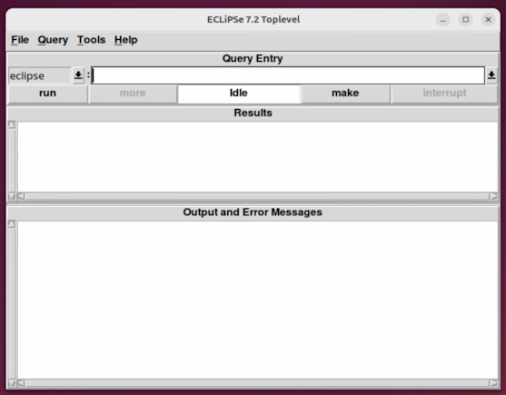

2025-11-06: work in progress: check remaining TBD's + diagram of map coloring problem of Germany-benchmark? I think so with so many tested dialects already/2025-11-11.

# Prolog

This page and its Prolog (= _**PRO**grammation en **LOG**ique_) programs started to exist for one reason:

> How fast is a (compiled) program in the [Mercury language](https://github.com/practicalcomputerscience/MicrobenchmarkGPHLlanguages/tree/main/03%20-%20source%20code/04%20-%20logic%20programming/Mercury#mercury) compared to a (compiled) version in its precursor language Prolog?

<br/>

---

Table of contents:

- [The map coloring problem of Germany with 16 states and 4 colors](#the-map-coloring-problem-of-germany-with-16-states-and-4-colors)
- [GNU Prolog](#gnu-prolog)
- [SWI Prolog](#swi-prolog)
- [Ciao Prolog](#ciao-prolog)
- [YAP Prolog](#yap-prolog)
- [ECLiPSe - Constraint Logic Programming System](#eclipse---constraint-logic-programming-system)
- [XSB Prolog](#xsb-prolog)
- [Tau Prolog - Prolog for the web](#tau-prolog---prolog-for-the-web)
- [Trealla Prolog](#trealla-prolog)
- [ISO standard, comments, etc.](#iso-standard-comments-etc)
- [Speed in the Land of Prolog's](#speed-in-the-land-of-prologs)
- [The Mercury benchmark program](#the-mercury-benchmark-program)

<br/>

---

## The map coloring problem of Germany with 16 states and 4 colors

Here I use a different microbenchmark program, albeit one, which I think is much more typical for problems of logic programming than my accidental microbenchmark program.

In 2017, I successfully tested this [Prolog program](https://github.com/practicalcomputerscience/MicrobenchmarkGPHLlanguages/blob/main/03%20-%20source%20code/04%20-%20logic%20programming/Prolog/graph_4coloring_Germany2a.pl), which I implemented back then in GNU Prolog version 1.3.0. It's this source code from 2013 at chapter "The Graph Coloring Problem": [Try logic programming! A gentle introduction to Prolog](https://web.archive.org/web/20170106042155/https://bernardopires.com/2013/10/try-logic-programming-a-gentle-introduction-to-prolog/)


..and now I thought that this is a good program to compare the execution speeds of a Prolog program and its version in Mercury.

However, Prolog shows the same phenomenon than Scheme: what dialect to use?

> Even though the core of the Prolog programming language has been standardized by ISO since 1995, it remains difficult to write complex Prolog programs that can run unmodified on multiple
Prolog implementations. Indeed, implementations sometimes deviate from the ISO standard and the standard itself fails to cover many features that are essential in practice.

from: [Making ProB Compatible with SWI-Prolog](https://www.cambridge.org/core/journals/theory-and-practice-of-logic-programming/article/making-prob-compatible-with-swiprolog/4813E70D0F335F079CE013F2CD84D003), 2022

Here's a list of [Prolog implementations](https://en.wikipedia.org/wiki/Comparison_of_Prolog_implementations).

<br/>

## GNU Prolog

With GNU Prolog I immediately ran into a problem: 

- I was not able to compile and install a later (v.1.5.0) and the latest version (v.1.6.0) of GNU Prolog:

- http://gprolog.org/#download
- https://github.com/didoudiaz/gprolog

I tried with three different Linux versions (openSUSE 16 Leap, Oracle Linux 10, Ubuntu 24 LTS) in vain. Another curious phenomenon was that all distributions showed (slightly) different error messages.

Finally, I just installed an older GNU Prolog version with the [Ubuntu package manager](https://installati.one/install-gprolog-ubuntu-22-04/), something which worked:

```
$ sudo apt-get update
$ sudo apt-get -y install gprolog
$ gplc --version  # test the compiler
Prolog compiler (GNU Prolog) 1.4.5
...
$
```

Obviously, I'm not the only one with GNU Prolog problems: https://github.com/didoudiaz/gprolog/issues/82

Building a standalone executable is very easy in GNU Prolog: _$ gplc ./graph_4coloring_Germany2a.pl_

But before running program [graph_4coloring_Germany2a](https://github.com/practicalcomputerscience/MicrobenchmarkGPHLlanguages/blob/main/03%20-%20source%20code/04%20-%20logic%20programming/Prolog/graph_4coloring_Germany2a.pl), make sure to have enough space on the stack. The usual 32kB is too small for this program. So, as one way, you could add in your _.bashrc_ file this global environment variable: _export GLOBALSZ=524288_, where 524288 bytes is just my proposal, which works in my system. Activate: _$ source ./.bashrc_ and check the new environment variable:

```
$ printenv GLOBALSZ
524288
$
$ ./graph_4coloring_Germany2a
number N of different solutions = 191808

               SH, MV, HH, HB, NI, ST, BE, BB, SN, NW, HE, TH, RP, SL, BW, BY
1st solution = red,blue,blue,red,green,blue,green,red,green,red,blue,red,green,red,red,yellow
...
Last solution = yellow,green,green,yellow,blue,green,blue,yellow,blue,yellow,green,yellow,blue,yellow,yellow,red
$
```

## SWI Prolog

I took GNU Prolog source code file named _graph_4coloring_Germany2a.pl_ and could run it without changes on SWI Prolog:

```
$ swipl graph_4coloring_Germany2a.pl
number N of different solutions = 191808

               SH, MV, HH, HB, NI, ST, BE, BB, SN, NW, HE, TH, RP, SL, BW, BY
1st solution = red,blue,blue,red,green,blue,green,red,green,red,blue,red,green,red,red,yellow
...
Last solution = yellow,green,green,yellow,blue,green,blue,yellow,blue,yellow,green,yellow,blue,yellow,yellow,red
$
```

However, this didn't make a standalone executable program. Building one is more complicated than in GNU Prolog.

This web page gives a hint how to accomplish it: https://www.swi-prolog.org/FAQ/UnixExe.md (*)

I slightly changed the original program, now named [graph_4coloring_Germany2c_SWI.pl](https://github.com/practicalcomputerscience/MicrobenchmarkGPHLlanguages/blob/main/03%20-%20source%20code/04%20-%20logic%20programming/Prolog/graph_4coloring_Germany2c_SWI.pl), where I changed goal _main_ into _graph_4coloring_Germany2c_SWI_, the later with no more initialization:

```
/* :- initialization(graph_4coloring_Germany2c_SWI). */
...
graph_4coloring_Germany2c_SWI :- ...
```

Then I managed with this command:

```
$ swipl -o graph_4coloring_Germany2c_SWI -g graph_4coloring_Germany2c_SWI -c graph_4coloring_Germany2c_SWI.pl --stand_alone=true
Warning: /usr/lib/swi-prolog/library/ansi_term.pl:45: 
Warning:   library(uri): No such file
% Disabled autoloading (loaded 32 files)
% Disabled autoloading (loaded 0 files)
$
$ ./graph_4coloring_Germany2c_SWI 
number N of different solutions = 191808

               SH, MV, HH, HB, NI, ST, BE, BB, SN, NW, HE, TH, RP, SL, BW, BY
1st solution = red,blue,blue,red,green,blue,green,red,green,red,blue,red,green,red,red,yellow
...
Last solution = yellow,green,green,yellow,blue,green,blue,yellow,blue,yellow,green,yellow,blue,yellow,yellow,red
$ 
```

However, program _graph_4coloring_Germany2c_SWI_ doesn't run on a foreign Linux system without needed shared libraries (*): 

> Otherwise, you must make the shared objects available and findable to make the program usable on another computer.

Here, I look at the **target system** to see what is missing (and hope that it's not too much):

```
> ldd ./graph_4coloring_Germany2c_SWI
        linux-vdso.so.1 (0x00007fefeb954000)
        libswipl.so.9 => not found
        libc.so.6 => /lib64/libc.so.6 (0x00007fefeb73a000)
        /lib64/ld-linux-x86-64.so.2 (0x00007fefeb956000)
>
```

..and copy file _libswipl.so.9_ from the source system to the target system, into a directory where it can be found automatically, like this for example: _sudo cp libswipl.so.9 /lib64_

This should work now:

```
> ./graph_4coloring_Germany2c_SWI
number N of different solutions = 191808

               SH, MV, HH, HB, NI, ST, BE, BB, SN, NW, HE, TH, RP, SL, BW, BY
1st solution = red,blue,blue,red,green,blue,green,red,green,red,blue,red,green,red,red,yellow
...
Last solution = yellow,green,green,yellow,blue,green,blue,yellow,blue,yellow,green,yellow,blue,yellow,yellow,red
>
```

Both dialects, GNU and SWI, came to the same number of different solutions, that is 191808, and also show the same 1st solution and same last solution.

## Ciao Prolog

I also tested Ciao Prolog: https://ciao-lang.org/

Again, I had to slightly change the original source code to make the program working in this [dialect](https://github.com/practicalcomputerscience/MicrobenchmarkGPHLlanguages/blob/main/03%20-%20source%20code/04%20-%20logic%20programming/Prolog/graph_4coloring_Germany2b_Ciao.pl).

What's unkown in Ciao, is predicate _nth0()_, which I changed to _nth()_, which I made available with clause: _:- use_module(library(lists))._ See from here at [core/lib/lists.pl](https://github.com/ciao-lang/ciao/blob/fdff410cf2b7f2b85baff97485a2db5522d785f3/core/lib/lists.pl)

Building a standalone executable is easy in Ciao Prolog:

```
$ ciao comp -S ./graph_4coloring_Germany2b_Ciao.pl  # -S switch for building a standalone executable
$ ./graph_4coloring_Germany2b_Ciao
number N of different solutions = 191808

               SH, MV, HH, HB, NI, ST, BE, BB, SN, NW, HE, TH, RP, SL, BW, BY
1st solution = red,blue,blue,red,green,blue,green,red,green,red,blue,red,green,red,red,yellow
...
Last solution = yellow,green,green,yellow,blue,green,blue,yellow,blue,yellow,green,yellow,blue,green,yellow,red
$
```

While the 1st solution is the same as with GNU and SWI, the last solution is different. Ciao Prolog obviously computes things a little bit differently.

## YAP Prolog

I also tested YAP Prolog: https://www.dcc.fc.up.pt/~vsc/yap/index.html

Here's a quick installation guide for Ubuntu 24 LTS: make a zip file from related GitHub repository: https://github.com/vscosta/yap, and unzip it to (default) directory: _./yap-master_

Then change into this directory and do this:

```
$ mkdir Build
$ cd Build
$ sudo apt install libreadline-dev  # for the readline() library: this is essential to have!
$ cmake ../
$ make
$ ./yap  # this is a preliminary test
YAP 8.0.1-GITDIR-N (compiled  2025-11-08T00:11:56@...)
database loaded from ~/scripts/Prolog/YAP Prolog/yap-master/Build/startup.yss

?- halt.  # type halt. to stop the ommand-line interface
YAP execution halted.
$ sudo make install
```

Now run a little test program, here I take David Warren's [original quicksort benchmark program](https://github.com/practicalcomputerscience/MicrobenchmarkGPHLlanguages/blob/main/03%20-%20source%20code/04%20-%20logic%20programming/Prolog/quicksort_benchmark.pl), which gives two warnings in modern Prolog versions, but runs OK otherwise:

```
$ time yap -L ./quicksort_benchmark.pl
~/scripts/Prolog/YAP Prolog/quicksort_benchmark.pl:20:17: warning, singleton variable I in user:main/0.

~/scripts/Prolog/YAP Prolog/quicksort_benchmark.pl:25:11: warning, singleton variable H in user:range/3.

[27,74,17,33,94,18,46,83,65,2,32,53,28,85,99,47,28,82,6,11,55,29,39,81,90,37,10,0,66,51,7,21,85,27,31,63,75,4,95,99,11,28,61,74,18,92,40,53,59,8]
[0,2,4,6,7,8,10,11,11,17,18,18,21,27,27,28,28,28,29,31,32,33,37,39,40,46,47,51,53,53,55,59,61,63,65,66,74,74,75,81,82,83,85,85,90,92,94,95,99,99]

real	0m0,147s
user	0m0,144s
sys	    0m0,003s
$ 
```

This microbenchmark program runs more than double as fast in YAP Prolog as in SWI Prolog: ~150 milliseconds versus ~360 milliseconds wall clock time!

The Ciao version of the program of interest, that is _graph_4coloring_Germany2b_Ciao.pl_, runs in YAP Prolog without any problems, however this time slower than with SWI Prolog:

```
$ time yap -L ./graph_4coloring_Germany2b_Ciao.pl 
number N of different solutions = 191808

               SH, MV, HH, HB, NI, ST, BE, BB, SN, NW, HE, TH, RP, SL, BW, BY
1st solution = red,blue,blue,red,green,blue,green,red,green,red,blue,red,green,red,red,yellow
...
Last solution = yellow,green,green,yellow,blue,green,blue,yellow,blue,yellow,green,yellow,blue,green,yellow,red

real	0m0,946s
user	0m0,913s
sys	    0m0,033s
$
```

The last solution is the same as with Ciao Prolog.

Building a standalone executable is apparently not supported in YAP Prolog.

<br/>

It may be no coincidence that **SWI Prolog** runs relatively faster at a problem with a higher number of elements (or iterations) than a lower number of elements (or iterations). I'm apparently not the only one to make this observation:

> While testing SWI-Prolog’s performance, I noticed something interesting. When repeatedly running qsort, the speed isn’t particularly high for about 1,000 iterations, but at 10,000 iterations, it reaches 20 MLIPS. Why is this?

from: [Chasing the Speed of SWI-Prolog: Exploring Optimizations and Hidden Performance Tricks](https://medium.com/@kenichisasagawa/chasing-the-speed-of-swi-prolog-exploring-optimizations-and-hidden-performance-tricks-152f91fb30cb), Kenichi Sasagawa, 2025-02-22

SWI's speed maybe due to its [Just-in-time clause indexing](https://www.swi-prolog.org/pldoc/man?section=jitindex):

> YAP provides full JIT indexing, including indexing arguments of compound terms. YAP's indexing has been the inspiration for enhancing SWI-Prolog's indexing capabilities.

<br/>

## ECLiPSe - Constraint Logic Programming System

I also tested ECLiPSe (https://eclipseclp.org/index.html), whose "aim is to serve as a platform for integrating various Logic Programming extension" (see from User Manual at: https://eclipseclp.org/doc/).

Here's a quick installation guide for Ubuntu 24 LTS: I downloaded latest _eclipse_basic.tgz_ (as of 2025-11-08) from: https://eclipseclp.org/Distribution/Dev/7.2_4/x86_64_linux/, renamed it for some versioning to _eclipse_basic_7.2_4.tgz_ and unzipped it to directory: _./eclipse_basic_7.2_4_

Now change into that directory and do this:

```
$ sudo ./RUNME  # here you are guided interactively through the installation process;
# you can skip TCL/TK and Java installations for basic functionality; as root seems to be essential in a "standard" Ubuntu installation
...
$
```

Add to your PATH in the _.bashrc_ file for example: _PATH=$PATH:~/scripts/Prolog/ECLiPSe/eclipse_basic_7.2_4/bin/x86_64_linux_ and activate it: _$ source ~/.bashrc_

You may test ECLiPSe with starting its command-line interface: _$ eclipse_

The _RUNME_ script can be run repeatedly, if things went wrong.

For using ECLiPSe's Java interface, the path to your JRE (Java Runtime Environment) directory can be asked like this:

```
$ java -XshowSettings:properties -version 2>&1 > /dev/null | grep 'java.home'
    java.home = /usr/lib/jvm/java-21-openjdk-amd64
$ 
```

The TCL/TK GUI can be installed and started like this, but first better make sure that _wish_ is visible, and not shadowed:

```
$ whereis wish
wish: /usr/bin/wish /usr/share/man/man1/wish.1.gz
$ sudo apt install wish  # you may do this if wish cannot be found; wish is essential for ECLiPSe's Tcl scripts
$ sudo apt install tcl  # test with: $ tclsh
$ sudo apt install tk
$ tkeclipse
```

Hopefully, you get this window popping up now:



The [Quicksort_benchmark script](./quicksort_benchmark_eclipse.pl) runs OK:

```
$ time eclipse -f ./quicksort_benchmark_eclipse.pl
File quicksort_benchmark_eclipse.pl, line 26: Singleton variable I
File quicksort_benchmark_eclipse.pl, line 31: Singleton variable H
[27, 74, 17, 33, 94, 18, 46, 83, 65, 2, 32, 53, 28, 85, 99, 47, 28, 82, 6, ...]
[0, 2, 4, 6, 7, 8, 10, 11, 11, 17, 18, 18, 21, 27, 27, 28, 28, 28, 29, ...]

real	0m0,175s
user	0m0,152s
sys	0m0,022s
$
```

..but again, not without changes, like _local_ initialization and a _halt._ without an argument.

Adaption of the coloring of Germany program, including a custom predicate for _nth()_ or _nth0()_, got the [ECLiPSe program version](./graph_4coloring_Germany2d_ECLiPSe.pl) also running:

```
$ eclipse -f ./graph_4coloring_Germany2d_ECLiPSe.pl 
number N of different solutions = 191808

               SH, MV, HH, HB, NI, ST, BE, BB, SN, NW, HE, TH, RP, SL, BW, BY
1st solution = red, blue, blue, red, green, blue, green, red, green, red, blue, red, green, red, red, yellow
...
Last solution = yellow, green, green, yellow, blue, green, blue, yellow, blue, yellow, green, yellow, blue, green, yellow, red
$
```

It's 1st and last solutions are the same as Ciao's 1st and last solutions for example, if you take away the space characters from ECLiPSe's output.

Building a standalone executable is apparently not supported in ECLiPSe.

And, ECLiPSe runs pretty fast, beating SWI Prolog!

<br/>

## XSB Prolog

Installation tips: to build and install XSB Prolog correctly, even in a basic version (I didn't do more), is a little bit tricky from my point of view.

I used the "Download Snapshot" button from here: https://sourceforge.net/p/xsb/code/ci/git-origin/tree/, though also these current sources only got me version 5.0.0 from 2022. 

Then I shortened the resulting super-long file name to _xsb-code.zip_, unzipped it, and changed to directory: _$ cd ./xsb-code/XSB/build_

Then I ran: _$ ./configure_

Like hopefully given as the last order, start the compilation with: _$ ./makexsb_

Add the path to _xsb_ in your _.bashrc_ file (_PATH=$PATH:~/scripts/Prolog/XSB_Prolog/xsb-code/XSB/bin_) and activate it. The version can be tested with command: _$ xsb -v_

However, I didn't figure out how to smarter provide the path to a source code file than providing its _absolute_ path: _$ xsb ~/scripts/Prolog/XSB_Prolog/graph_4coloring_Germany2e_XSB.pl_

Something like this usual command isn't working in my system:

```
$ xsb ./graph_4coloring_Germany2e_XSB.pl
...
++Error[XSB/Runtime/P]: [Existence (No file for module ./graph_4coloring_Germany2e_XSB.pl exists)] []
...
$
```

When you use the xsb REPL, wrap it before using it: _$ rlwrap xsb_

Building a standalone executable is apparently not supported in XSB Prolog. But when the source code file hasn't changed, _xsb_ is using a formerly generated byte code file, here named _graph_4coloring_Germany2e_XSB.xwam_, at the next execution: _$ xsb ~/scripts/Prolog/XSB_Prolog/graph_4coloring_Germany2e_XSB.pl_

By the way: here, I measured the execution time with command: _$ ./exe_times_statistics_for_one_test_case_in_cwd2 "xsb ~/scripts/Prolog/XSB_Prolog/graph_4coloring_Germany2e_XSB.pl --quietload"_

<br/>

## Tau Prolog - Prolog for the web

While Tau Prolog, [a Prolog Interpreter for the Web](https://www.cambridge.org/core/journals/theory-and-practice-of-logic-programming/article/tau-prolog-a-prolog-interpreter-for-the-web/4D99CAEBCF06B072AF4D028FA7B06CC5), seems like an interesting idea, I didn't get bigger things accomplished with it (in up-to-date version 0.3.4 beta), including the benchmarking program of the map coloring problem of Germany.

I made a subpage with more details: [Tau Prolog: Prolog embedded in JavaScript](https://github.com/practicalcomputerscience/MicrobenchmarkGPHLlanguages/tree/main/03%20-%20source%20code/04%20-%20logic%20programming/Prolog/Tau%20Prolog#tau-prolog-prolog-embedded-in-javascript)

However, my results should not discourage anybody from experimenting with Prolog code inside JavaScript code, be it for web pages or for **node.js**.

<br/>

## Trealla Prolog

https://github.com/trealla-prolog/trealla/tree/main

I took file _tpl-linux-x64.zip_ from here: https://github.com/trealla-prolog/trealla/releases/tag/v2.84.17, unzipped it to default directory _./tpl-linux-x64_, expanded my _$PATH_ environment variable to that directory and tested the version like this: _$ tpl -v_

Answer was: _realla Prolog (c) Infradig 2020, v2.84.16_ So, this a very simple Prolog version to install. 

I measured the microbenchmark's execution time like this, which means that the GNU version of this program works here without a change:

```
$ ./exe_times_statistics_for_one_test_case_in_cwd2 "tpl -f ./graph_4coloring_Germany2a.pl"
...
number N of different solutions = 191808

               SH, MV, HH, HB, NI, ST, BE, BB, SN, NW, HE, TH, RP, SL, BW, BY
1st solution = red,blue,blue,red,green,blue,green,red,green,red,blue,red,green,red,red,yellow
...
Last solution = yellow,green,green,yellow,blue,green,blue,yellow,blue,yellow,green,yellow,blue,yellow,yellow,red
=======================
SUM = 44810 [milliseconds]
mean = 2224 [milliseconds]
$
```

This result is identical to the one of GNU or SWI Prolog. Building a standalone executable is apparently not supported in Trealla Prolog.

<br/>

## TBD

TBD

<br/>

### ISO standard, comments, etc.

GNU, SWI and Ciao Prolog claim to follow the [ISO standard of Prolog](https://www.iso.org/standard/21413.html), albeit I think that the potential possibility to port the source code from one dialect to the other without changes is the bigger benefit.

After having tested several Prolog dialects, again, nothing more than scratching at their surfaces, choosing the right dialect seems to be more difficult than with [Scheme](https://github.com/practicalcomputerscience/MicrobenchmarkGPHLlanguages/tree/main/03%20-%20source%20code/02%20-%20functional%20languages/Scheme#scheme). While SWI Prolog nowadays seems to look like the first dialect to go for, the also ambitious, fast and very actively maintained ECLiPSe Constraint Logic Programming System, which is for sure lesser known, looks like another interesting choice; the only system I tested which actively markets a graphical user interface by the way.

On commenting in Prolog source code: generally, % should work as a remaining line comment; /* ... */ should work as a block comment, potentially comprising more than one line. The official examples at the [Ciao playground](https://ciao-lang.org/playground/) _may_ give the impression that only character % works, but this is false, since both comment symbols have already been around the 1980ies, as a view into old documents can reveal: [A Prolog Benchmark Suite for Aquarius](https://apps.dtic.mil/sti/tr/pdf/ADA211444.pdf)

It's maybe worth to note that Prolog was not the first logic programming languages, but Absys, which first appeared in 1967: https://en.wikipedia.org/wiki/Absys, [Absys: the first logic programming language —A retrospective and a commentary](https://www.sciencedirect.com/science/article/pii/0743106690900309?via%3Dihub)

<br/>

In Prolog, I also tumbled over the question: **Are rules and clauses the same thing in Prolog?**

Apparently not always. A rule in Prolog looks like this or similarly to this and denotes a _conditional truth_:

_nearby(X,Y):-connected(X,Z,L),connected(Z,Y,L)._ (I got this example from this classical book from 1994: https://github.com/simply-logical/simply-logical/releases/tag/v1.0 (*))

Further: _A program is a set of clauses, each of them terminated by a period._(*). So, a clause is a higher level concept, and a rule is just one type of a clause in my understanding.

<br/>

## Speed in the Land of Prolog's

Let the benchmarking game begin with usual command _$ sudo perf stat -r 20 ./graph_4coloring_Germany2..._, again with the best run out of 3:

Prolog dialect | best run out of 3
--- | ---
GNU | mean = 1597 [milliseconds]
SWI | 0,69330 +- 0,00175 seconds time elapsed  ( +-  0,25% )
Ciao | 0,75810 +- 0,00150 seconds time elapsed  ( +-  0,20% )
YAP | 0,93109 +- 0,00254 seconds time elapsed  ( +-  0,27% )
ECLiPSe | mean = 574 [milliseconds]
XSB | mean = 612 [milliseconds]
Trealla Prolog | mean = 2224 [milliseconds]

So, about 570 milliseconds is the benchmark time a logically equivalent Mercury program must beat!

<br/>

There was a problem with the GNU Prolog program again, since environment variable _GLOBALSZ_ is apparently not recognized in the context of _perf stat_. Instead, I took the [shell script](https://github.com/practicalcomputerscience/MicrobenchmarkGPHLlanguages/blob/main/02%20-%20execution%20times/exe_times_statistics_for_one_test_case_in_cwd2) again: _$ ./exe_times_statistics_for_one_test_case_in_cwd2 ./graph_4coloring_Germany2a_. I also used it to time measure the ECLiPSe, XSB and Trealla Prolog programs.

<br/>

## The Mercury benchmark program

TBD

<br/>

##_end
