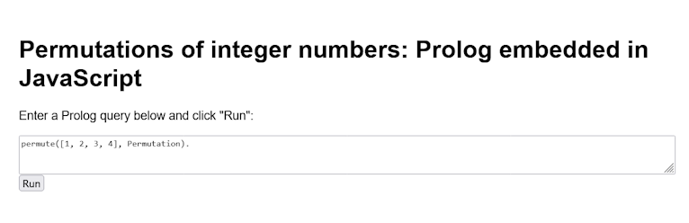
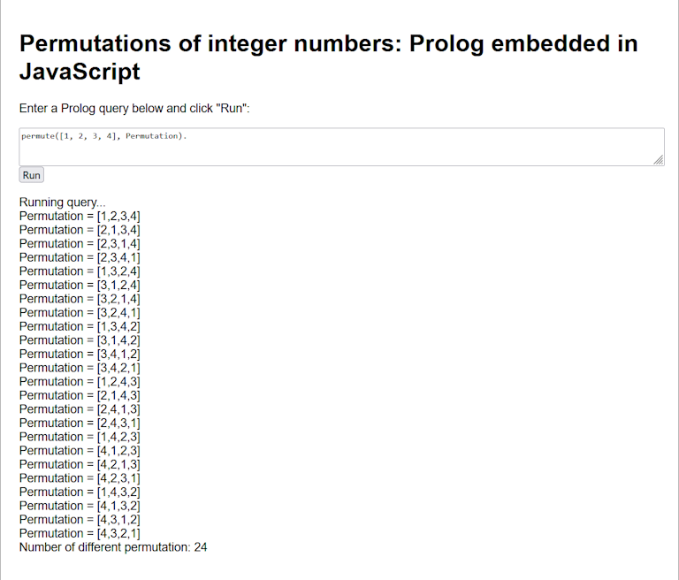

2025-11-10: work in progress

# Tau Prolog: Prolog embedded in JavaScript

http://tau-prolog.org/

---

Table of contents:

- [The Tau Prolog sandbox](#the-tau-prolog-sandbox)
- [Smaller problems with Tau Prolog that worked](#smaller-problems-with-tau-prolog-that-worked)
- [Products and shops example](#products-and-shops-example)
- [Quicksort](#quicksort)
- [Permuting a list of numbers for node.js](#permuting-a-list-of-numbers-for-nodejs)
- [Permuting a list of numbers for the web](#permuting-a-list-of-numbers-for-the-web)

---

## The Tau Prolog sandbox

According to my experience, the best way to start with Tau Prolog is to use the official sandbox: http://tau-prolog.org/sandbox/

I noticed that the _:- use_module(library(lists))._ clause isn't needed there, since this library seems to be visible anyway.

Since the complete map coloring problem of Germany, with 16 states and 4 colors, also in this sandbox, doesn't come to a final result (within a reasonable amount of time), I developed a shorter version with only the first 8 states (but still with four colors):


So, enter the Prolog code into the left box under "Program" and press the "Consult program" button, or after code changes the "Reconsult program" button, that is for code:

```
color(red).
color(green).
color(blue).
color(yellow).

neighbor(StateAColor, StateBColor) :- color(StateAColor), color(StateBColor), StateAColor \= StateBColor.

germany(SH,MV,HH,HB,NI,ST,BE,BB) :-
neighbor(SH, NI),
neighbor(SH, HH),
neighbor(SH, MV),
neighbor(HH, NI),
neighbor(MV, NI),
neighbor(MV, BB),
neighbor(NI, HB),
neighbor(NI, BB),
neighbor(NI, ST),
neighbor(ST, BB),
neighbor(BB, BE).
```

Now check the default query limit in the upper right box. For this problem, I increased it to **100000**. If not, "limit exceeded" can easily be reached!

Then enter the Prolog query, that is also Prolog's goal, into its upper right box - including the full stop character! - like this: 

```
findall((SH,MV,HH,HB,NI,ST,BE,BB),germany(SH,MV,HH,HB,NI,ST,BE,BB),L).
```

Then press the [ENTER] key at the query's end to start Prolog's computations. List _L_ hopefully is then being shown, in this example with all valid results.

We can let Prolog count all resulting color combinations with an expanded query, like this for example:

```
findall((SH,MV,HH,HB,NI,ST,BE,BB),germany(SH,MV,HH,HB,NI,ST,BE,BB),L),length(L,N).
```

Or not, since with me, length N of solution list L is not shown - as if it has been forgotten!

By the way: for convenience, Prolog online service SWISH (https://swish.swi-prolog.org), based in SWI Prolog, can calculate the result correctly, it's: _N = 1728_ (and also correct solution _N = 191808_ for the complete problem.)

Later, I downsized the problem to only three colors and four simple variables A, B, C, D of this program:

```
color(red).
color(green).
color(blue).

color_map(A, B, C, D) :-
color(A),
color(B),
color(C),
color(D),
A \= B,
A \= C,
B \= D,
C \= D.
```

..and query: _findall((A, B, C, D), color_map(A, B, C, D), L), length(L, N)._ ..and voilà: length _N = 18_ is also provided correctly:


<br/>

What I can already say about Tau Prolog, is this from my point of view:

> [!CAUTION]
> At the moment, with version 0.3.4 beta, it's advised to re-check results and returns provided by a Tau Prolog program with another, more established Prolog system. 

<br/>

However, this is not the way I started with Tau Prolog. Emboldened by my success with other [Prolog dialects](https://github.com/practicalcomputerscience/MicrobenchmarkGPHLlanguages/tree/main/03%20-%20source%20code/04%20-%20logic%20programming/Prolog#prolog) so far, I immediately tried to embed working Prolog code for the complete map coloring problem of Germany in a JavaScript program to be executed by [node.js](https://nodejs.org/en) - only to fail.

## Smaller problems with Tau Prolog that worked

### Products and shops example

A good starting point for the following developments of smaller problems was this official "products and shops" example: http://tau-prolog.org/manual/compatibility-with-nodejs

Here's the [source code](https://github.com/practicalcomputerscience/MicrobenchmarkGPHLlanguages/blob/main/03%20-%20source%20code/04%20-%20logic%20programming/Prolog/Tau%20Prolog/tau_prolog_products_and_shops_example.js), and some tips:

- first, install Tau Prolog in your Linux system like this for example: _$ npm install tau-prolog_
- run this program like this for example with argument _water_: _$ nodejs ./tau_prolog_products_and_shops_example.js water_, or alternatively: _$ nodejs ./tau_prolog_products_and_shops_example.js water_

Anyway, this output should be shown now:

```
$ node ./tau_prolog_products_and_shops_example.js water
ItemID = 2, ShopID = 1, Price = 0.25, Shop = tau
ItemID = 2, ShopID = 2, Price = 0.31, Shop = swi
false
$
```

### Quicksort

With the basics apparently working, I worked on the [quicksort program](./tau_prolog_quicksort_benchmark.js) for node.js, as used at [YAP Prolog](https://github.com/practicalcomputerscience/MicrobenchmarkGPHLlanguages/blob/main/03%20-%20source%20code/04%20-%20logic%20programming/Prolog/quicksort_benchmark.pl) (**) already as a test case:

```
$ node ./tau_prolog_quicksort_benchmark.js 
27,74,17,33,94,18,46,83,65,2,32,53,28,85,99,47,28,82,6,11,55,29,39,81,90,37,10,0,66,51,7,21,85,27,31,63,75,4,95,99,11,28,61,74,18,92,40,53,59,8
S = [0,2,4,6,7,8,10,11,11,17,18,18,21,27,27,28,28,28,29,31,32,33,37,39,40,46,47,51,53,53,55,59,61,63,65,66,74,74,75,81,82,83,85,85,90,92,94,95,99,99]
false
$ 
```

Here, things already started to become more challenging, since the quicksort core program is repeated 9,999 times in the original benchmark program. At first, I wanted to maintain the loop logic within the Prolog code, like in the original program (**):

```
main :- range(1,I,9999), qsort(_), fail.
main :- write_s0, nl,  % new: show the original list of integer numbers
        qsort(S), write(S), nl,
        halt(0).       % new: exit this program

range(L,L,H).
range(L,I,H) :- L<H, L1 is L+1, range(L1,I,H).
```

However, this approach already showed the limits of Tau Prolog:

```
// Define the goal:
const goal = `
    qsort(S).
    % loop_n_times(1000, qsort(S)). % this is not coming back!
    % loop_n_times(200, qsort(S)).  % this takes 44 sec with: pl.create(10000000);
`;
```

The only feasible solution I found in the end was to implement these iterations as (outer) JavaScript code, where the Prolog goal _qsort(S)_ is just called 9,999 times (I didn't bother with 9,999 or 10,000 actual times):

```
// do the looping in JavaScript to get 10,000 iterations done:
for (let i = 0; i < runs; i++) {
  session.consult(program, {
      success: function() {
          session.query(goal, {
              success: function() {
                  // session.answers(show);
                  // no operation here
              }
          })
      }
  });
}
```

The next issue was that I didn't intend to show the result of each quicksort run _in Prolog_, because the original program isn't doing it either, so here I finally do one last quicksorting only to show the sorted list:

```
// do one last run to show the sorted result like in the other Prolog programs:
session.consult(program, {
    success: function() {
        // session.query(goal_last, {
        session.query(goal, {
            success: function() {
               session.answers(show);
            }
        })
    }
});
```

### Permuting a list of numbers for node.js

To get closer to my goal of solving the map coloring problem of Germany, I thought that first implementing some simple permutation task for [node.js](./tau_prolog_number_permutation.js) and potentially as as [web page](./tau_prolog_number_permutation.html) with some user interaction would be a helpful idea.

This algorithm is closer to the map coloring problem, since it has a "natural" beginning and a "natural" end, and all results, limited in scope, can be nicely shown and easily checked by a human being:

```
$ node ./tau_prolog_number_permutation.js 
Permutation = [1,2,3,4]
Permutation = [2,1,3,4]
Permutation = [2,3,1,4]
Permutation = [2,3,4,1]
Permutation = [1,3,2,4]
Permutation = [3,1,2,4]
Permutation = [3,2,1,4]
Permutation = [3,2,4,1]
Permutation = [1,3,4,2]
Permutation = [3,1,4,2]
Permutation = [3,4,1,2]
Permutation = [3,4,2,1]
Permutation = [1,2,4,3]
Permutation = [2,1,4,3]
Permutation = [2,4,1,3]
Permutation = [2,4,3,1]
Permutation = [1,4,2,3]
Permutation = [4,1,2,3]
Permutation = [4,2,1,3]
Permutation = [4,2,3,1]
Permutation = [1,4,3,2]
Permutation = [4,1,3,2]
Permutation = [4,3,1,2]
Permutation = [4,3,2,1]
false
$ 
```

### Permuting a list of numbers for the web

Natively embedding Prolog code in a web page with the help of JavaScript also has the great advantage to be very platform-agnostic; program development can also conveniently happen with a different operating system. So, here's the result when opening this [HTML page](./tau_prolog_number_permutation.html): (please download and open the _raw file_ :wink:)



Now, let's click "Run":



Here are some notable points about this HTML page, since Tau's official (gaming) examples go into a different direction from my point of view.

The first development step was to get me a very simple HTML page with some JavaScript in it; MS Bing AI and Duck.ai got me this.

Then, the first hurdle was to provide access to Tau Prolog for this web page. This is happening here, something I also got in the end after prompting MS Bing AI and Duck.ai:

```
  <!-- check latest code version -->
  <script src="https://unpkg.com/tau-prolog@0.3.4/modules/core.js"></script>
  <script src="https://unpkg.com/tau-prolog@0.3.4/modules/lists.js"></script>
```

Basically, these two lines are the biggest secret of success for Tau Prolog, since developing the scripting part was more or less glueing together different AI-based answers and fine-tuning them:

```
  <script>
    // Create a Tau Prolog session
    const session = pl.create(1000);
    session.consult(`
        % source: Duck.ai on prompt: "Tau Prolog all permuations of numbers 1, 2, 3, 4"
        %
        % Base case: the permutation of an empty list is an empty list
        permute([], []).
        
        % Recursive case: permute a list by fixing each element and permuting the rest
        permute([H|T], Permutation) :-
            permute(T, RestPermutation),
            insert(H, RestPermutation, Permutation).
        
        % Insert an element into all possible positions in a list
        insert(X, L, [X|L]).  % Insert X at the head
        insert(X, [Y|Rest], [Y|L]) :-
            insert(X, Rest, L).  % Insert X into the tail      
    `);

    function runQuery() {
      const query = document.getElementById("query").value;
      document.getElementById("output0").textContent = "Running query...\n";

      let length0 = 0;  // counter of permutations
      
      session.query(query);
      session.answers(x => {
        if (x === false) {
          // document.getElementById("output0").textContent += "No more answers.\n";
          document.getElementById("output0").textContent += "Number of different permutation: " + length0 + "\n";
        } else {
          document.getElementById("output0").textContent += session.format_answer(x) + "\n";
          length0 += 1;  // calculate the number of permutations
        }
      });
    }
  </script>
```

With the help of JavaScript, it's also rather easy to implement a counter of program runs, here named _length0_, for counting the number of permutations at the false branch of _if (x === false)_ with _length0 += 1;_.

It's also interesting to see how Prolog query _permute([1, 2, 3, 4], Permutation)._, something which can be modified by the user before running the program, is then being sequentially evaluated and resulting in one answer _x_ after the other until there is no more answer.


<br/>

So, at this point, I cannot provide a working Tau Prolog program for the map coloring problem of Germany. Hence, a Tau Prolog version is missing from the [Prolog benchmark list](https://github.com/practicalcomputerscience/MicrobenchmarkGPHLlanguages/tree/main/03%20-%20source%20code/04%20-%20logic%20programming/Prolog#speed-in-the-land-of-prologs).

<br/>

##_end
